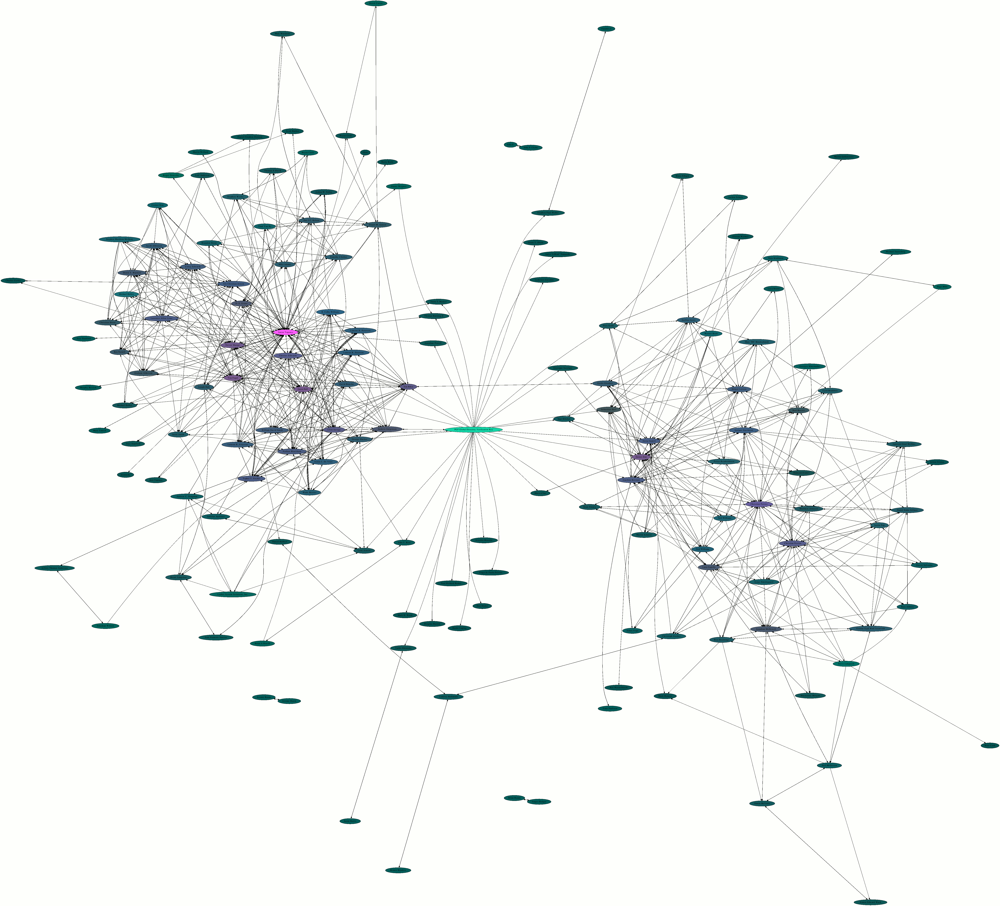

.. include:: <s5defs.txt>

================
Keysigning Party
================

:Author: Aaron Toponce
:Email: aaron.toponce@gmail.com
:Date: 2011-09-10

License
=======

This presentation is licensed under the Creative Commons
Attribution-ShareAlike License.

See http://creativecommons.org/licenses/by-sa/3.0/ for more details.

.. container:: handout

    This document is licensed under the CC:BY:SA
    Details to the license can be found here:
    http://creativecommons.org/licenses/by-sa/3.0/

    The licnese states the following:

     - You are free to copy, distribute and tranmit this work.
     - You are free to adapt the work.

    Under the following conditions:

     - You must attribute the work to the copyright holder.
     - If you alter, transform, or build on this work, you may redistribute the
       work under the same, similar or compatible license.

    With the understanding that:

     - Any conditions may be waived if you get written permission from the
       copyright holder.
     - In no way are any of the following rights affected by the license:

         - Your fair dealing or fair use rights;
         - The author's moral rights;
         - Rights other persons may have either in the work itself or
           in how the work is used, such as publicity or privacy rights.

     - For any reuse or distribution, you must make clear to others the license
       terms of this work. The best way to do this is with a link to the web
       page provided above or below.

    The above is a human-readable summary of the license, and is not to be used
    as a legal substitute for the actual licnse. Please refer to the formal
    legal document provided here:
    http://creativecommons.org/licenses/by-sa/3.0/legalcode

Background
==========

.. class:: slides

- Public key cryptography

  - Public key is handed out

    - Encrypts data and verifies signatures

  - Private key is kept secret

    - Decrypts data and creates signatures

- Digital signatures

  - Software releases (Debian, Apache, etc.)
  - Other OpenPGP keys
  - Email/Usenet/BBS text 

Security
========

.. class:: slides

- Access to keyservers is *not* authenticated

  - Anyone can upload a key
  - Only trust keys in your web of trust
  - Only sign keys when identiy is established

    - Don't trust conversations over email or IM
    - Face-to-face is preferred

- Create RSA public keys with 2048-bits or stronger

  - Avoid DSA
  - Use the SHA2 algorithms for signatures

Web of Trust
============

.. class:: slides

- Decentralized trust model
- Establishes authenticity of owner to key
- Establishes trust between the public key and its owner
- Low "Mean Signature Distance" (MSD) is preferred
- http://aarontoponce.org/pubring.gif

Web of Trust
============

.. class:: slides

PGP Strong Set
==============

.. class:: slides

- http://pgp.cs.uu.nl
- The largest known Web of Trust- almost 45,000 keys
- Top 25 keys and all but 15 of the top 50 belong to the Debian project

The Party
=========

.. class:: slides

- Line up in two lines, face-to-face
- Read your fingerprint from YOUR printout
- Verify the fingerprint with the handout
- Verify identity

  - Use government-issued identification on new contacts
  - Identification isn't needed for family, friends or coworkers

- Move one person to the left

  - The ends move to the other line, facing the opposite direction

After the Party
===============

.. class:: slides
.. role:: green

- Sign every key and subkey under the public fingerprint

  - This includes signing every UID

- Retrieve keys with:

  - :green:`gpg --keyserver pgp.mit.edu --recv-keys $ID`

- Sign keys with:

  - :green:`gpg --ask-cert-level --sign-key $ID`
  - Select option #3- "I have done very careful checking"

- Send keys with:

  - :green:`gpg --keyserver pgp.mit.edu --send-keys $ID`

