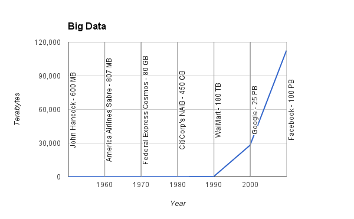
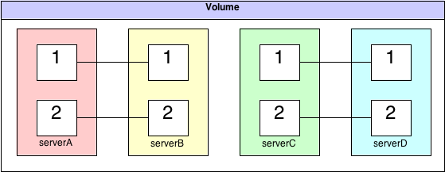
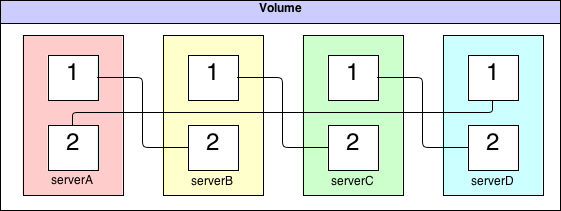

.. include:: <s5defs.txt>

===============
GlusterFS 1010 
===============

:Author: Aaron Toponce
:Email: aaron.toponce@gmail.com
:Date: March 19, 2013

Contact and Details
===================

You can find the source code, PDF, compressed tarball and HTML presentation
at http://aarontoponce.org/presents/glusterfs.

My email address: aaron.toponce@gmail.com.

License
=======

This presentation is licensed under the Creative Commons
Attribution-ShareAlike license.

See http://creativecommons.org/licenses/by-sa/3.0/ for more details.

.. container:: handout
    
    This document is licensed under the CC:BY:SA
    Details to the license can be found here:
    http://creativecommons.org/licenses/by-sa/3.0/

    The licnese states the following:
     * You are free to copy, distribute and tranmit this work.
     * You are free to adapt the work.
    Under the following conditions:
     * You must attribute the work to the copyright holder.
     * If you alter, transform, or build on this work, you may redistribute
       the work under the same, similar or compatible license.
    With the understanding that:
     * Any conditions may be waived if you get written permission from the
       copyright holder.
     * In no way are any of the following rights affected by the license:
     
         * Your fair dealing or fair use rights;
         * The author's moral rights;
         * Rights other persons may have either in the work itself or
           in how the work is used, such as publicity or privacy rights.
           
     * For any reuse or distribution, you must make clear to others the
       license terms of this work. The best way to do this is with a link
       to the web page provided above or below.

    The above is a human-readable summary of the license, and is not to be
    used as a legal substitute for the actual licnse. Please refer to the
    formal legal document provided here:
    http://creativecommons.org/licenses/by-sa/3.0/legalcode

What is GlusterFS?
==================

* Clustered filesystem
* Designed for commodity hardware
* Linear scalability
* High availability

Why GlusterFS?
==============

`"cloud server" vs "cloud storage"
<https://www.google.com/trends/explore#q=cloud%20server,%20cloud%20storage>`_

Largest Data Usage
==================

FUSE
====

* Uses the FUSE module
* Not in kernelspace
* Not slow - runs at wirespeed

Architecture
============

* Strongly consistent
* Peer consisted of "bricks"
* Volume consisted of connected peers
* Different from MooseFS or Ceph
* No metadata server - elastic hashing
* Files not split into chunks
* Supports TCP and RDMA

Volume Types
============

* Distributed
* Replicated
* Striped
* Distributed replicated
* Distributed striped

Distributed
===========

* Distribute files throughout the bricks in the volume.
* No redundancy (JBOD).

Striped
=======

* Stripes data across bricks in the volume.
* No redundancy, high performance (RAID-0).

Replicated
==========

* Replicate files throughout the bricks in the volume.
* High redundancy (RAID-1).

Distributed replicated
======================

* Distributes files across replicated bricks in the volume.
* Number of bricks should be a multiple of the replica count.
* High redundancy, high availability.

Distributed striped
===================

* Stripe data across two or more nodes in the cluster.
* Number of bricks should be a multiple of the stripe count.
* High performance, high concurrency, no redundancy.

General Idea
============

* Bricks created on peer
* Peers connected together
* Volume mounted by FUSE clients

Paired Server Topology
======================

* Servers added/removed in pairs
* Simple administration

Linked List Volume Topology
===========================

* Servers added/removed individually
* Complex administration

Creating A Volume
=================

* ``gluster peer probe server1``
* ``gluster peer probe server2``
* ``gluster volume create clstrfck replica 2 transport tcp server1:/vol1 server2:/vol1 server1:/vol2 server2:/vol2``
* ``gluster volume start clstrfck``

Mounting A Volume
=================

* ``mount -t glusterfs server1:clusterfck /srv``

Additional Administration
=========================

* Adding peers: ``gluster peer probe server3``
* Removing peers: ``gluster peer detach server1``
* Adding bricks: ``gluster volume add-brick clstrfck server3:/vol1 server3:/vol2``
* Adding geo-replication: ``gluster volume geo-replication clstrfck offsite:/backup``

Help
====

* `Offical Gluster Docs <http://gluster.org/community/documentation/index.php/Main_Page>`_
* `gluster-users mailing list <http://www.gluster.org/mailman/listinfo/gluster-users>`_
* `Q&A Forums <http://community.gluster.org/>`_
* `Bug Tracker <https://bugzilla.redhat.com/>`_
* IRC: irc://irc.gnu.org#gluster, irc://irc.freenode.net:#gluster
