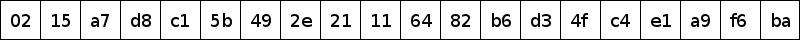
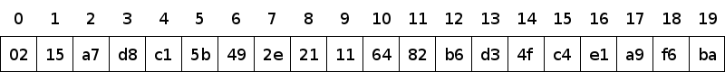
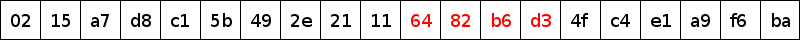
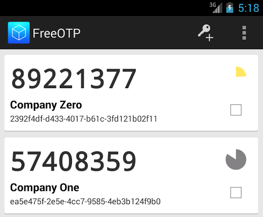
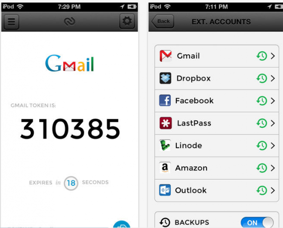
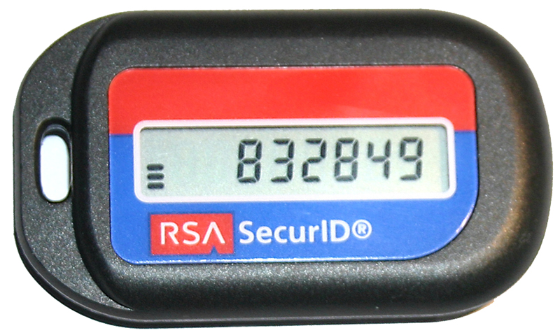
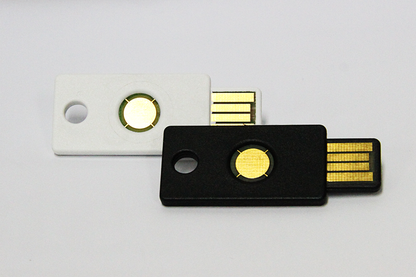
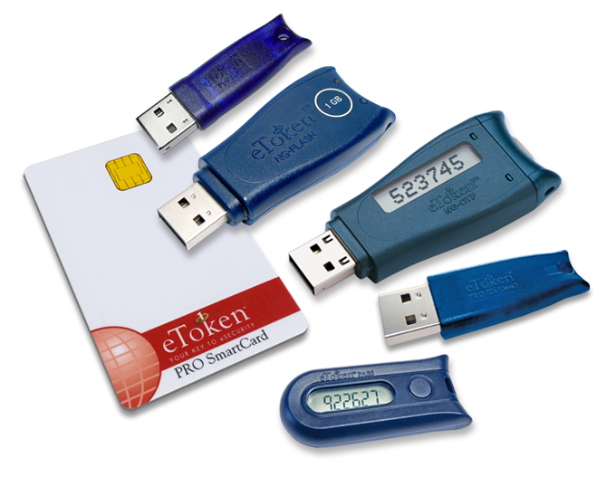
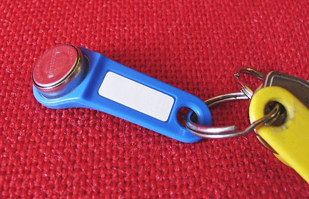

.. include:: <s5defs.txt>

===========================
Multi-Factor Authentication
===========================

:Author: Aaron Toponce
:Email: aaron.toponce@gmail.com
:PDF: http://ae7.st/s/bj
:Date: 2014-10-22

License
=======

This presentation is licensed under the Creative Commons Attribution-ShareAlike
license.

See http://creativecommons.org/licenses/by-sa/3.0/ for more details.

.. container:: handout
    
    This document is licensed under the CC:BY:SA
    Details to the license can be found here:
    http://creativecommons.org/licenses/by-sa/3.0/

    The licnese states the following:
     * You are free to copy, distribute and tranmit this work.
     * You are free to adapt the work.
    Under the following conditions:
     * You must attribute the work to the copyright holder.
     * If you alter, transform, or build on this work, you may redistribute the
       work under the same, similar or compatible license.
    With the understanding that:
     * Any conditions may be waived if you get written permission from the
       copyright holder.
     * In no way are any of the following rights affected by the license:
         * Your fair dealing or fair use rights;
         * The author's moral rights;
         * Rights other persons may have either in the work itself or
           in how the work is used, such as publicity or privacy rights.
     * For any reuse or distribution, you must make clear to others the license
       terms of this work. The best way to do this is with a link to the web
       page provided above or below.

    The above is a human-readable summary of the license, and is not to be used
    as a legal substitute for the actual licnse. Please refer to the formal
    legal document provided here:
    http://creativecommons.org/licenses/by-sa/3.0/legalcode

Overview
========

* Why static passwords aren't working.
* What is multi-fator authentication?
* Software Tokens
* Hardware Tokens
* SMS, Phone Call, Email

.. container:: handout

    First, we'll look over why the static password is actually failing to
    setup the case for multi-factor authentication. Then we'll look at a
    number of different multi-factor authentication implementations, such
    as software tokens, hardware tokens, SMS text messages, interactive
    phone calls, email messages, and more.

Static Password Fail?
=====================

* People reuse passwords.
* People choose the familiar.
* People use the bare minimumm requirements.

.. container:: handout

    First, we need to examine why the static passwourd fails before we can
    look at multi-factor authentication.

    Static passwords are failing, because of the human equation not
    understanding how to create good strong passwords. It really doesn't
    have anything to do with the fact that it's a single factor of
    authentication. If people removed themselves from the equation, and
    created truly random, and mathematically sound passwords, the world
    would be a much different place.

    However, people like to construct their own passwords, even though they
    may think that the passwords are strong. I had a discussion with a
    friend one day, who honestly thought his password was sound. It was 9
    characters in length, was based on a dictionary word, had 1 uppercase
    character, and 1 digit. Yet, his Twitter account fell victim to an
    online brute force login attempt. How embarassing.

    Static passwords fail, because people like the familiar. They reuse old
    passwords if a company has password rotation policies. They'll pick
    passwords based on personally identifiable information, such as
    birthdays, names, anniversaries, favorite sports teams, etc. But worst
    off all, people will use the absolute bare minimum requirements for
    creating a password.

    If a password policy says something like the following: "A password
    must be between 8 and 30 characters in length, must include at least 1
    uppercase character, 1 digit, and 1 special character", guess what the
    person will choose? An 8, or maybe 9 character password, all lowercase,
    with exactly 1 uppercase character, 1 digit, and 1 special character.

    There is zero motivation to move past those requirements. As such,
    passwords will fall victim to offline attacks, despite the capability
    to design much stronger, and cracking resistent passwords.

Password Failing Stats
======================

* http://passwordresearch.com/stats/
* 64% write their password down
* 65% reuse the same password
* 70% do not use a unique password for each site
* 25% forget their password regularly
* 82% have forgotten at least one password
* 33% have shared their account with their partner
* 33% have shared their password in the past 30 days
* CEOs are less likely to use strong passwords than CTOs

.. container:: handout

    Abone are just some statistics of passwords. Most are self-explanatory,
    but some are worth mentioning here.

    Writing down your password isn't necessarily a Bad Thing. Sure, if it's
    written down on a sticky note stuck to your monitor, then that probbaly
    isn't a good idea, but there are other ways in which you password
    could, and probably should be written down.

    First, there are password managers which store your passwords in an
    encrypted database, which is protected by a master password. These
    password managers can keep the account credentials 100% secure,
    provided the master password is secure. Everything falls apart when the
    master password is chosen to be weak, by lacking sufficient entropy to
    withstand on offline password cracking attempt.

    Another way in which passwords could be written down is with the
    PasswordCard at https://passwordcard.org. In this case, a grid of
    random characters is printed on a card, with column symbols as a
    header, and row colors and numbers as a row identifier. The user
    selects the startking position of column and row on the card, picks a
    direction and a length. The result is a password that can contain
    enough entropy to withstand a sophisticated offlite password cracking
    attempt, and the card can be stored in your wallet or purse. If the
    card is stolen or lost, the attacker must know who the password card
    belongs to, what their accounts are, and where the passwords reside,
    and the paths they take.

    Another interesting statistic in that list is sharing passwords with
    your partner. This actually isn't necessarily a bad idea, unless the
    relationship becomes strained. But, if you partner has access to your
    accounts, and the relationship is built on trust, then should something
    happen to you, your partner can get into your accounts, and use those
    for various needs, such as for insurance or financial reasons.

Static Passwords Can Work
=========================

* TRUE RANDOM!!!1one
* Sufficient entropy

.. container:: handout

    Despite what this presentation is about, static passwords CAN actually
    work. It just requires understanding two very important concepts:

        * The password MUST be chosen by truly random events.
        * The password MUST have sufficient entropy to withstand a
          sophisticated attack.

    When humans influence the design and structure of their passwords, as
    already discussed, they chose the bare minimum requirements and they
    choose the familiar. Even if the individual tries to make the password
    as random as possible, they do a horrible job at it. Humans are far too
    predictable, and are not good judges of what is random and what is not.

    There are ways in which passwords can be truly randomly generated. It
    requires using either a software program that relies on either a true
    hardware random number generator, or at least a random number generator
    that is cryptographically secure. These software password generators
    can provide very strong results that will not fall victim to an offline
    password cracking attempt.

    Other ways to generate truly random passwords cane be done offline,
    without the aide of a computer. These could be things like rolling dice
    or flipping coins to "choose" words from a large list. As already
    mentioned, the PasswordCard is a physical card with a pre-generated
    grid of random characters. The indidividual picks the starting
    location, path, and length, and the card does the rest.

    However the password is generated, it must be truly random, and the
    individual is not allowed to influence the design of the password at
    all.

    In order to build a strong random password though, you need to
    understand the cocept of "entropy". Entropy is just an estimate for the
    unpredictability of something. In physics, you learn it as a
    measurement for the unpredictability of energy in thermodynamics. As
    energy disapates, entropy increases. With computer scienc, entropy is a
    measurement of the unpredictability of the system, or in our case,
    passwords.

    Think of entropy like a haystack, and your password like a needle. The
    more entropy you have, or the larger the haystack, the harder it will
    be for the password cracker to find your needle.

    Calculating entropy comes from calculating the total number of
    combinations giving a set of objects and a length. For example, suppose
    you want to generate a password with 8 characters using only lowercase
    alphabetic characters. Then you have;

        ``_ _ _ _ _ _ _ _ = 26*26*26*26*26*26*26*26 = 26^8 = 208,827,064,576``

    As such, there are approximately 208 billion total passwords using only
    lowercase alpahbetic characters of 8 characters in length.

    However, how unpredictable could each password be from the other? This
    is measured in bits, and we need to do some maths. Let y = possible
    combinations, b = each individual character, and x = length of the
    password. Then:

        ``y = b^x``

    Easy enough. Let's manipulate it a bit. Taking the log of base-b on
    both sides gives us:

        ``log_b(y) = x``

    Using a property of logarithms, we can change the base. Because Claude
    Shannon defined entropy in binary bits, or base-2, we get:

        ``log_b(y) = log_2(y)/log_2(b) = x``

    So, going back to our example of an 8 character string with only
    alphabetic characters, we get:

        ``log_26(y) = log_2(y)/log_2(26) = 8``

    Thus:

        ``log_2(y) = 8 * log_2(26)``

    Let ``H = log_2(y)``, or our entropy estimate. Then:

    ::

        H = 8 * log_2(26)
          = 8 * log(26)/log(2)

    Or, generically speaking:

    ::

        H = L*log2(N)
          = L*log(N)/log(2)

    where H is the resultant entropy of the password given in binay bits, L
    is the length of the password and N is the number of possible symbols
    in the password.

    For example, the password ``BBslwys90!?`` has a length of 11. It also
    uses characters from the lowercases character set, uppercase character
    set and the number and "special character" character sets. So, N=94, in
    this case. Thus 11*log2(94)=72. This password has an entropy of 72
    binary bits.

    What this means is that a brute force password cracking utility would
    have a search space of 2^72 or 4,722,366,482,869,645,213,696 possible
    passwords to search through for a 72-bit entropy password. Of course,
    understanding probability means that the utility won't have to search
    every password in the search space. It should stop when the password is
    found, even if there are more passwords remaining.

    Consider the following table:

.. class:: table
    :class: handout

    ============= ========= ========== ============== ======================
     Entropy (H)   Numbers   Alphabet   Alphanumeric   All ASCII characters
    ============= ========= ========== ============== ======================
        32           10          6           6                 5
        40           13          8           7                 7
        64           20          12          11                10
        80           25          15          14                13
        96           29          17          17                15
        128          39          23          22                20
        160          49          29          27                25
        192          58          34          33                30
        224          68          40          38                35
        256          78          45          43                40
        384          116         68          65                59
        512          155         90          86                79
        1024         309         180         172               157
    ============= ========= ========== ============== ======================

.. container:: handout

    Looking at the table above, the "Entropy (H)" column shows the desired
    bit strength that you wish your password to have. For example, suppose
    you wanted your password to have a bit strength of 80. Then, if your
    password consisted of only numbers, it would need to be 25 digits long.
    If you wanted your password to consist of all chracters from the entire
    ASCII character set, then you would only need a password of 13
    characters for 80 bits of entropy.

    To have sufficient entropy to withstand a sophisticated attack, even by
    the most well-funded adversaries, 72-bits to 88-bits is generally
    considered the target.

Cracking History
================

* CERT - 47642/186126 (1998)
* Rockyou.com - 32 million (2009)
* NATO - 11,000 (2011)
* Booz Allen Hamilton 90,000 (2011)
* LinkedIn, eHarmony, SoSasta, Habib Bank
* MangaTraders, Forbes, SnapChat
* Adobe, AhaShare, EuroGunz, Apple, Yahoo
* Digital Playground, Youporn, Sony, Gawker

.. container:: handout

    In all honesty, there is really nothing we can do to prevent password
    databases from getting leaked to the Internet. People will always be
    subjected to social engineering attacks, phishing attacks, and just
    standard human error. As such, password database will continue to be
    leaked. The only control we have, is how well we created our passwords
    and the amount of entropy it contains.

    With that said, there have been a lot of password databases released on
    the Internet, and there has been great success in recovering passwords
    from these databases. With little GPU clusters, a bit of ingenuity, and
    some patience, 90% password recovery is achievable in practical time.
    This includes passwords like:

        * :LOL1313le
        * Coneyisland9/
        * momof3g8kids
        * 1368555av
        * n3xtb1gth1ng
        * qeadzcwrsfxv1331
        * m27bufford,
        * J21.redskin
        * Garrett1993*
        * Oscar+emmy2

    That's an impressive list, from what you would think are relatively
    strong passwords.
    
    It should be mentioned that these passwords are typically hashed with a
    one-way hashing function. As such, the hash cannot be reversed to
    recover the original input. So, the password cracker must work through
    large word lists, or search in a target incremental fashion, by taking
    the word one-at-a-time, hashing it, and comparing it to what is in the
    database. Of course, the search should progress at billions of guessing
    per second, as the search space could be very, very large.

Cracking Tools
==============

* Aircrak-ng
* Cain & Abel
* John the Ripper
* KisMAC
* THC-Hydra
* hashcat-utils
* oclHashcat

.. container:: handout

    There are a number of tools for cracking passwords in a variety of
    ways. Below is a summary of each of the password cracking tools in the
    above list, taken directly from the main site for each.

    Aircrack-ng is an 802.11 WEP and WPA-PSK keys cracking program that can
    recover keys once enough data packets have been captured. It implements
    the standard FMS attack along with some optimizations like KoreK
    attacks, as well as the PTW attack, thus making the attack much faster
    compared to other WEP cracking tools.

    Cain & Abel is a password recovery tool for Microsoft Operating
    Systems. It allows easy recovery of various kind of passwords by
    sniffing the network, cracking encrypted passwords using Dictionary,
    Brute-Force and Cryptanalysis attacks, recording VoIP conversations,
    decoding scrambled passwords, recovering wireless network keys,
    revealing password boxes, uncovering cached passwords and analyzing
    routing protocols. The program does not exploit any software
    vulnerabilities or bugs that could not be fixed with little effort. It
    covers some security aspects/weakness present in protocol's standards,
    authentication methods and caching mechanisms; its main purpose is the
    simplified recovery of passwords and credentials from various sources,
    however it also ships some "non standard" utilities for Microsoft
    Windows users.

    John the Ripper is a fast password cracker, currently available for
    many flavors of Unix, Windows, DOS, BeOS, and OpenVMS. Its primary
    purpose is to detect weak Unix passwords. Besides several crypt(3)
    password hash types most commonly found on various Unix systems,
    supported out of the box are Windows LM hashes, plus lots of other
    hashes and ciphers in the community-enhanced version.

    KisMAC is a wireless network discovery tool for Mac OS X. Cracking of
    WEP and WPA keys, both by brute force, and exploiting flaws such as
    weak scheduling and badly generated keys is supported when a card
    capable of monitor mode is used, and packet reinjection can be done
    with a supported card (Prism2 and some Ralink cards). GPS mapping can
    be performed when an NMEA compatible GPS receiver is attached.

    THC-Hydra is a software project developed by van Hauser from
    the organization called The Hacker's Choice (THC) and David Maciejak.
    It uses a dictionary attack to test for weak or simple passwords on one
    or many remote hosts running a variety of different services. It was
    designed as a proof-of-concept utility to demonstrate the ease of
    cracking poorly chosen passwords. It is a parallized login cracker
    which supports numerous protocols to attack.

    Hashcat-utils are a set of small utilities that are useful in advanced
    password cracking. They all are packed into multiple stand-alone
    binaries. All of these utils are designed to execute only one specific
    function. Since they all work with STDIN and STDOUT you can group them
    into chains.

    OclHashcat is a GPGPU-based multi-hash cracker using a brute-force
    attack (implemented as mask attack), combinator attack, dictionary
    attack, hybrid attack, mask attack, and rule-based attack. This tool is
    available for all Windows and Linux versions should work on both 32 and
    64 bit.

Wordlists
=========

* UNIQPASS v14 (241,584,732 entries) - $12.99
* Openwall (45 million entries) - $27.95
* Outpost9 (millions) - free
* Custom lists

.. container:: handout

    Word lists aide the password cracker while searching for passwords.
    Typically, word lists are at least 7 or 8 characters in length. This is
    because a password cracker can recover all possible 1- to 6-character
    passwords near instantly on a single GPU. Surprisingly enough, this
    will reveal up to 40% of the passwords in a password database.

    After a cracker has cracked all 6-character passwords, it's then time
    to get selective about what to attack. Cracking all 7-character
    passwords with just lowercase letters can happen in just a couple
    minutes, as is the case with cracking all 8-character passwords with
    just lowercase letters. These steps can then be repeated with only
    searching uppercase character passwords, as well as just uppercasing
    the first character of the password and the last character of the
    password. These steps can reveal another 20-30% of the password
    database.

    It's only after this point that word lists, like those listed above,
    are turned to. Now the password cracker becomes very, very selective
    about what he hits, and how. Although word lists like those from
    UNIQPASS, Openwall and Outpust9 are helpful, most password crackers
    will have a finely tuned word list that they have been tweaking over
    the years. Custom word lists occupy a great deal of disk space, so the
    attacker must be selective about what is put into the word list.

    After the word lists are exhausted, the last thing to do is an
    incremental brute force search. As you can imagine, the search takes
    considerable time to work through the remainng 7- and 8-character
    passwords, let alone searching through the 9-, 10-, and 11-character
    passwords.
    
    However, the cracker can be smart about it. There is no need to go into
    a blind incremental search. Instead, the attacker can apply rules and
    strategies, such as appending dates at the end of word lists, or
    creating "1337-speak" searching. The number of special characters can
    be limited to 1 or 2, as is the same with digits and uppercase
    characters. Being smart about the search can reveal another 10-15% of
    the password database, even for what seems to be fairly complex
    passwords. Typically, 80-85% of the password database can be recovered
    in 24 hours, with smart searching, and solid word lists.

Multi-factor Authentication
===========================

* Two-factor, three-factor
* What you know.
* What you have.
* Who you are.
* TOTP/HOTP, SMS, Email, Phone, Hardware, Software

.. container:: handout

    Multi-factor authentication is the ability to prove who you are many
    different ways. For example, if we had never met, and I clamed that my
    name was Aaron Toponce, you might ask for me to prove it. At this
    point, I would provide you with my identification card, driver license,
    or passport as proof to the claim. This is authentication.

    For websites, this is typically done in the form of usernames and
    passwords. However, presenting a password to the server is just
    something that you know. And, because it must be stored on the server,
    it can be copied and shared (leaked). This allows others to "prove"
    they are you by gaining knowledge on something only you should know.

    Now, you could require the user to know many things, not just a
    password. You could have them look at a gallery of photos, and select
    the photo they picked at account creation. You could ask them a
    number of different challenge/response questions, but you're never
    really getting past the knowledge factor, and the ability for this
    knowledge to be shared.

    Multi-factor authentication is the ability to prove you are who you
    claim through another channel. This is done by providing something like
    a sacrificial token or scanning a card on your person. This channel
    would be something you have. A third form could be through something
    that makes up who you are, such as a fingerprint, a DNA sample, or a
    retinal scan.

    There are a number of ways in which these second and third forms of
    authentication can be presented to the server, and this is what this
    presentation is about. These factors could be hardware or software
    tokens in various forms. They could be an SMS message sent to the
    user's cell phone, or an email sent to their email address. Interactive
    phone calls are another way in which to authenticate the user.

    Providing things you are could be a fingerprint or hand scan. Facial
    recognition, although controversial, is a valid way to provide
    somehting the user is. Voice recognition, retinal scans, and DNA
    samples are other ways in which to prove the claim of identity.
    However, this factor seems to be less implemented than "what you have",
    mostly due to controversy. Fingerprint and hand scanners are easy
    enough to deploy, and they're certainly common, but then a private
    company has your fingerprint or hand scan. Is this something you trust?
    With software tokens, as an example, the factor does not contain
    anything that you are, and as such, keeps the hole closed for possible
    identiy fraud.

    Regardless, providing what you know, what you have, and what you are
    can be various ways in which to authenticate to the server.

TOTP/HOTP
=========

* Time-based One-time Passwords
* Hash-based One-time Passwords
* IETF Standard
* Does not require any 3rd party software
* Does not "call home" to another server
* Based on SHA1

.. container:: handout

    TOTP and HOTP are software algorithms that generate one-time passwords
    for an authentication session. TOTP stands for "time-based one-time
    passwords" while HOTP stands for "hash-based one-time passwords". Both
    are an IETF standard, which means an RFC on the standards track exists.

    Both TOTP and HOTP do not require any 3rd party software to implement.
    The specification is simple and easy to understand. Furether, other
    than the client communicating with the server, the server does not need
    to "call home" on any network connection to verify the TOTP and HOTP
    tokens. The calculations of the tokens can and should be done on the
    server in real time.

TOTP/HOTP Vendor Support
========================

* Google
* GitHub
* Wordpress
* OpenSSH through PAM
* Microsoft
* Facebook
* Amazon Virtual MFA for AWS
* Dropbox

.. container:: handout

    There is actually a great deal of TOTP and HOTP vender support on the
    server. Google uses it as part of their two-factor authentication when
    setting it up with your account. Github also uses TOTP directly as part
    of their two-factor authentication.

    Both Wordpress.com and the open source project at wordpress.org support
    setting up TOTP directly. For the open source project, it is handled
    through a plugin that you install into your blog.

    Google released a PAM plugin for GNU/Linux that you can install using
    two-factor authentication with either SSH or even directly for logging
    into your workstation.

    Others such as Microsoft, Facebook, Amazon, Dropbox, and others support
    TOTP through their account setup.

TOTP/HOTP Client Implementations
================================

* AuthShield
* Authy
* Google Authenticator
* Red Hat with FreeOTP
* Microsoft Authenticator
* OATH Toolkit
* SalesForce#
* Duo Mobile

.. container:: handout

    In terms of the client side that generates the tokens for the user to
    enter into the form to authenticate with the server, there are some
    client implementations that can be run mostly on mobile devices such as
    smartphones and tablets.

    Google Authenticator and FreeOTP are direct HOTP/TOTP clients. FreeOTP
    hides the codes by default, unless you tap the screen to show the code.
    This offers extra security for you account.

    AuthShield is a proprietary, closed source product, for Android, iOS,
    Blackberry, and other platforms. It uses TOTP, in addition to a
    challenge/response method.

    Authy is another proprietary, closed source product for Android and iOS
    that uses TOTP. However, Authy also provides a server software API for
    software developrs that would like to implement two-factor
    authentication in their infrastructure.

    Microsoft Authenticator is a closed source, proprietary mobile
    application for Windows Phone only. It's TOTP that actually looks and
    behaves almost exactly like Google Authenticator. And it's named the
    same. Heh.

    Initiative for Open Authentication (OATH) is an industry-wide
    collaboration to develop an open reference architecture using open
    standards to promote the adoption of strong authentication. It has
    close to thirty coordinating and contributing members and is proposing
    standards for a variety of authentication technologies, with the aim of
    lowering costs and simplifying their use. OATH should not be confused
    with OAuth, an open standard for authorization.

    There are many other clients available, such as SalesForce# and Due
    Mobile that can be available for many other mobile operating systems.

TOTP/HOTP Design
================

* Open standard, royalty-free
* Not patented nor copyrighted
* A private key
* A moving target (time, or counter)
* Computed using HMAC-SHA-1
* TOTP requires NTP on both the client and server

.. container:: handout

    So, as already mentinoed, TOTP/HOTP is an open standard, specified in
    RFCs, standardized by the IETF. Anyone can implement TOTP/HOTP without
    worrying about needing to pay royalties, infringing copyrights, etc.

    The specification of TOTP/HOTP is simple. It's based on HMAC-SHA-1,
    which requires two parts: a private key and a changing message. In the
    case of TOTP/HOTP, the server generates a private key, and gives it to
    the user. Then, after received, if using HOTP, a counter is incremented
    every time a token is needed. In the case of TOTP, the current time is
    used as the moving target (message). Regardless if using HOTP or TOTP,
    every token is different due to that moving target. If TOTP is
    required, then both the client and the server need to agree on the
    time. As such, NTP needs to be implemented, or some other authoritative
    time source.

TOTP Internals
==============

* A random private key is created server-side. EG: "WHDQ9I4W5FZSCCI0"
* The key is shared with the client. EG: A QR barcode
* The time is converted into seconds from the Unix Epoch. EG: 1397552400
* HMAC-SHA-1(key, seconds). EG: 0215a7d8c15b492e21116482b6d34fc4e1a9f6ba
* The HMAC is dynamically truncated to a 6-digit number.

.. container:: handout

    Looking at TOTP specifically, the server creates a private key that is
    delivered to the user. Typically, this is done by the way of a QR code.
    In all reality, the private key can be anything. The keys SHOULD be
    randomly generated or derived using key derivation algorithms, and
    should contain sufficient amounts of entropy (128-bits, 256-bits, etc).
    The key can be stored, but it should be stored on a tamper-resistent
    device, encrypted filesystem, etc., and access to the system that
    contains the key should be controlled.

    Once the user has installed the key on their mobile client, everything
    is ready to go for using TOTP. Because it's time-based, the client and
    the server need to agree on the time. This means that both the client
    device and the authenticating server should be using some sort of
    authoritative clock source, such as NTP to keep the clocks from
    drifting. However, there should also be a little give and take on the
    server. As such, although not required, the server should probably
    allow accepting the previous token, the previous token, and a future
    token, just in case the mobile device is 30 seconds slow or 30 seconds
    fast.

    The time in TOTP is converted to the UNIX epoch in seconds. This is the
    time from January 1, 1970 at midnight. Then, the private key that was
    agreed on by the server and the client, and the time in seconds are
    hashed using the HMAC-SHA-1 function. The result would be a hexadecimal
    string such as 0215a7d8c15b492e21116482b6d34fc4e1a9f6ba.

    Once the hexadecimal hash has been calculated, then the token is
    actually dynamically generated by using a deterministic algorithm on
    the hexadecimal string. This is called "dynamic truncation".

TOTP Dynamic Truncation
=======================

* Get the hexadecimal value of the lower 4-bits of our HMAC.
* Sart at that offset.
* Read the next 31-bits
* Convert those 32-bits to decimal mod 1 million.
* Our 6 digit result is the TOTP

.. container:: handout

    So, suposse that our hexadecimal hash is:
    
    ::

        0215a7d8c15b492e21116482b6d34fc4e1a9f6ba

    The deterministic algorithm starts by reading the last 4-bits of the
    HMAC hash. In this case, that is the character 'a', or '10' in decimal,
    or '1010' in binary. This tells us that we need to look at the 10th
    byte offset in the HMAC. Our byte offsets would look like this:

    ::

        Byte offset: 00 01 02 03 04 05 06 07 08 09 10 11 12 13 14 15 16 17 18 19
         HMAC-SHA-1: 02 15 a7 d8 c1 5b 49 2e 21 11 64 82 b6 d3 4f c4 e1 a9 f6 ba

    So, in this case, our 10-th byte offset begits with '64'. We start by
    reading the first bit in that offset, and read the next 31-bits
    following. This means that we have 32-bits in total, starting at the
    first bit in the 10-th byte offset of our hexadecimal string. Thus,
    reading those bits, we git the following data:

        ``6482b6d3``

    Now that we have these 32-bits in hexadecimal, we need to convert it to
    decimal. The result is:

    ::

        Hexadecimal: 6482b6d3
            Decimal: 1686288083

    Finally, we need to take our converted decimal value, and reduce it
    using modulo 1,000,000. In other words, we'll continue to subtract
    1,000,000 from the converted decimal value, until the result is 999,999
    or less. In our case:

    ``1686288083 % 1000000 = 288083``

    We allow of zero-padding on the left as necessary, to produce a valid
    6-digit number. So, the toke that would be presented to the user would
    be:

        ``288083``

    This token is what both the client and the server have generated, every
    30 seconds, at the top of the minute, and half-past the minute. If what
    the user presents in the token form matches what the server generates,
    then the token is valid, and the user is authenticated.

    As mentioned, because of potential clock drift, the server should
    probably calculate the tokens for 30 seconds in the past, the current
    time, and 30 seconds in the future, to allow for clock drift on the
    client's mobile device. The RFC doesn't require this, of course, but it
    probably be considered "best practice".

TOTP Example
============

* Step 1: |base|
* Step 2: |lower|
* Step 3: |index|
* Step 4: |dynamic|
* Step 5: 6482b6d3 = 1686288083
* Final: 1686288083 % 1000000 = 288083

.. container:: handout

    On this slide, is a visual representation of exactly what was just
    explained in the previous slide.

HOTP Difference
===============

* Uses a counter instead of time.
* HMAC-SHA-1(key, counter)
* Counter incremented at each login.
* Synchronization across devices is a problem.

.. container:: handout

    HOTP is similar to TOTP, except that using the UNIX epoch in seconds
    for the moving target, a number is incremented each time a token is
    generated. Other than that, the algorithm is identical. What is nice
    about using an incremented number, is that the clock does not need to
    be synchronized between the client and the server. This will work well
    for offline client devices, such as hardware tokens, that do not have a
    network connection.

    Unfortunately, HOTP has the problem with device synchronization. If the
    user has a mobile client for HOTP installed on a smartphone and a
    tablet, how do you keep the client devices synchronized? If the user
    uses a token on the tablet, the user will need to make sure to also
    increment the token on the tablet, so they both agree on the same token
    the next time it is needed.

    The server can calculate past numeric values as well as future values,
    much like it can calculate the past 30 seconds and the future 30
    seconds. The server can keep a "window", at which it will calculate
    tokens, until the counter matches. If the counter doesn't match within
    the window, then the token is not valid. If a token in the past or the
    future is matched, then a the pointer to what a valid token is, is
    updated server side, so it can re-increment based on the new counter.

TOTP/HOTP Security
==================

* All based on HMAC-SHA-1
* HMAC-SHA-1 can be replaced with a different HMAC (HMAC-SHA-256)
* SHA1 is still resistent to preimage attacks
* SHA1 is also resistant to second preimage attacks
* There are no known security vulnerabilities with HMAC-SHA-1
* The shared key must be kept private

.. container:: handout

    In both TOTP and HOTP cases, the entire security lies on HMAC-SHA-1.
    Currently, there are no known security vulnerabilities with HMAC-SHA-1,
    but should such problems arise, the RFC is flexible enough to replace
    the HMAC with a more secure one, such as HMAC-SHA-256.

    Even further, although there are theoretical collision attacks with
    SHA1, there are no known preimage or second preimage attacks with SHA1.
    A preimage attack is where the attacker tries to find the plaintext
    input value that produced the SHA1 output. A second preimage attack is
    where the attacker has a plaintext value, m1. The attacker would like to
    find a second plaintext value m2, such that SHA1(m1) = SHA1(m2). A
    second preimage attack differs from a collision attack, in that the
    plaintext is known with a second preimage attack. In a collision
    attack, any valid plaintexts that produce identical hashes will work.
    Knowing them in advance is not a requirement. As such, a second
    preimage attack is a special case of a collision attack.

Software Implementation
=======================

.. container:: handout

    Above is a screenshot of a software token TOTP/HOTP implementation from
    Red Hat, called FreeOTP running on an Android device.

Software Implementation (cont.)
===============================

.. container:: handout

    Above is a screenshot of a software token TOTP/HOTP implementation
    called Authy running on an iPod.

Vendor Push
===========

* Vendor sends an SMS to a phone number on file.
* Vendor sends an email to an address on file.
* Vendor calls the user to a phone number on file.

.. container:: handout

    Vendor pushing out tokens to client is interesting, and in all reality,
    there are virtually unlimited numbers of ways that a vendor can push a
    token to the sure, such as SMS, email, or placing an interactive phone
    call.

SMS Observations
================

* Phone number redirection.
* SMS code sent over the air.
* SMS coverage may be spotty.
* SMS is cheaper to implement than hardware tokens.
* SMS does not need to follow any specific algorithm.

.. container:: handout

    In the case of an SMS push, this can be a quick, flexible, and good way
    to push a software token to the user. The user only needs to have a
    cellular telephone that can receive SMS text messages. Unlike
    TOTP/HOTP, there is no software than needs to be installed, and no need
    for a tablet or smartphone. Further, the developers of the organization
    are free to develop their own implementation. They don't need to follow
    an RFC, and can use what best fits for their organization.

    However, the security of the SMS push has some interesting
    implications. First, because it is text message pushed over the
    cellular network, it is possible that the token is interecepted over
    the air. SMS coverage could also be spotty, and the user may not
    receive the token.

    No doubt though, SMS is cheaper to implement than hardware tokens, and
    cheaper for the end-user, as they won't need an expensive mobile
    device.

Hardware Tokens
===============

* Disconnected vs Connected
* RSA SecurID (compromising 40 million in 2011)
* Yubikey
* Verisign
* CRYPTOCard

.. container:: handout

    In the case of hardware tokens, there are two types of tokens.
    Connected tokens require a physical connection to the computer to
    deliver the token. These are things like USB or NFC devices, where a
    physical or wireless interface is used as the artery to transferring
    the token. Disconnected tokens require the user to enter the token
    manually. As such, the disconnected token will typically have an LCD
    display, that displays the token, and the user enters what he seen on
    the LCD screen into his keyboard.

    Probably the most famous disconnected token is RSA SecurID. This is a
    keychain tongle has a small LCD that displays 6-digit codes every 30
    seconds. When the user enters the token into the text field, the server
    then communicates with the RSA SecurID server, to verify if the token
    is valid. The hardware tokens do not have a network connection, so the
    token is "synchronized" using serial numbers when handed out to the
    user in the infrastructure.

    In 2011, hackers were able to get an employee inside of RSA Labratories
    to open an email attachment, that infiltrated their network, got access
    to the RSA SecurID source code, and as a result, was able to compromise
    40 million RSA SecurID hardware tokens. These 40 million hardware
    tokens absolutely needed to be reissued, and as of tady, it's not clear
    if all of them have been.

    Probably the most famous connected hardware token is the Yubikey.
    Unlike RSA SecurID, the Yubikey hardware is open hardware, the firmware
    running on the hardware is Free and Open Source Software, the client
    software to reimage the Yubikey firmware is Free and Open Source
    Software, and there is server-side software that you can install for
    your infrastructure, that is also Free and Open Source Software. Long
    story short, RSA does not value your freedom. Yubikey does.

    Yubikey hardware tokens contain two slots that can be programmed. They
    can store an AES key that can calculate a one-time session key, that is
    entered into the text field. The server has a copy of the user's public
    AES key, which is used to decrypt the entered token, and verify its
    validity. The Yubikey hardware slots can also be programmed for OATH,
    Challenge-Response, Static Password and/or YubiKey OTP with the AES
    keys. No software is needed for the Yubikey, as it presents itself as a
    keyboard to the host computer when plugged into the USB slot.

    There are many other hardware tokens out there, such as those from
    Verisign, CRYPTOCard, and others.

Hardware Token Observations
===========================

* Typically more expensive
* Typically more rugged (waterproof, dustproof, etc)
* Vulnerable to loss or theft
* Only as strong as the server-side implementation and security
* Resistent to snooping (code generated outside electronic channels)
* Can contain PKI certificates for encryption or signing

.. container:: handout

    Purchasing hardware tokens certainly bears the most of the cost when it
    comes to deploying hardware tokens in the infrastructure. Every
    employee needs one, and typically, it requires employee time to setup
    and configure. Compared to software tokens, where a the new employee
    could follow a wiki page in the internal company wiki, explaining how
    to get their mobile application setup, by scanning the QR code, etc.

    With that said, hardware token devices are almost always more rugged
    than a smartphone or tablet running a software application. They can be
    dustproof, waterproof, shockproof, etc. However, due to their size,
    they can also be lost or stolen. This increases the cost of the compnay
    as a new hardware token will need to be reissued and reconfigured.

    Further, hardware tokens are only as secure as the software running on
    the server to authenticate the user. In the case of RSA SecurID and
    Yubikey, these have seen a lot of security and scrutiny, and the server
    software has been tested, debugged, and used by millions. Some other
    obsucre, less well known hardware tokens may have not seen this
    scrutiny, and as such, there are no guarantees that the cryptography,
    if implemented, has been implemented correctly.

    But, hardware tokens are resistant to MITM attacks generally, and
    resistent to snooping and interception, especially with connected
    tokens. Hardware tokens can contain limited storage space to store PKI
    certificates that can also be used for encryption, decryption, digital
    signatures, and verification.

Phone, Email, and Other Factors
===============================

* Interactive phone calls
* Emails
* Magnetic stripe cards
* Smartcards
* Bluetooth/wireless
* Audio port
* One-time pads
* Photo galleries
* n-dimensional patterns
* Custom form-factors

.. container:: handout

    There are many other factors of authentication that can be used and have
    been explored in various fashions. An interesting one to me is the
    one-time pad. In this case, the user and the server physically meet in
    advance to distribute identical one-time passwords, or over a secure
    channel. Google uses one-time passwords in lieu of not having your
    mobile device with you. Of course, once the one-time passwords have
    been exhausted, then the client and server must meet again, to
    regenerate the passwords. They must be truly random, and never shared,
    or lost.

    Android Lollipop 5.0 has a "Smart Lock" feature, where physical
    proximity to a trusted device can unlock the Android phone, such as in
    a car or at your desktop. When the physical proximity is lost, then the
    phone is locked. Physical proximity can be a great way to provide that
    second factor of authentication. This can be done over Bluetooth or
    802.11.

    There are many, many other factors of multi-factor authentication that
    can be explored.

Hardware Tokens
===============

.. container:: handout

    Above is an image of an RSA SecurID hardware dongle that you can have
    on your keychain.

Hardware Tokens (cont.)
=======================

.. container:: handout

    Above is an image of a Yubikey that can be used as a connected token
    which is plugged into a USB interface.

Hardware Tokens (cont.)
=======================

.. container:: handout

    Above is an image of various eTokens, including a smartcard, USB
    devices, and a keychain dongle.

Hardware Tokens (cont.)
=======================

.. container:: handout

    Above is an image of a proprietary hardware device that is physically
    placed in a port, that uses induction (much like RFID or NFC) to
    transfer the information stored on the dongle.

Conlusion
=========

* Comments?
* Questions?
* Rude Remarks?
