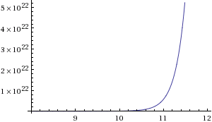
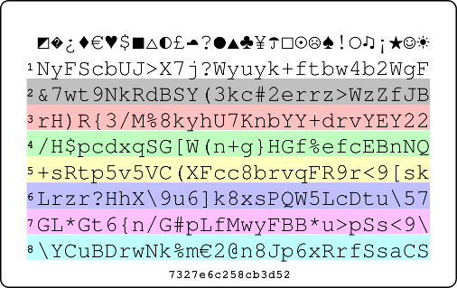
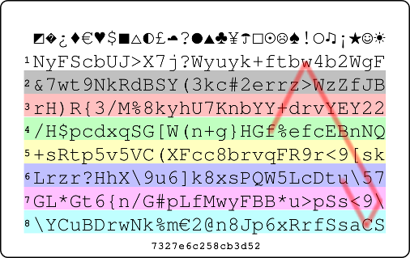
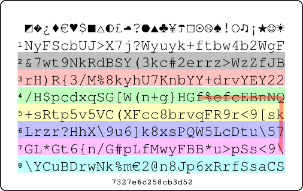
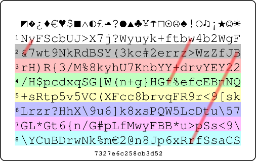
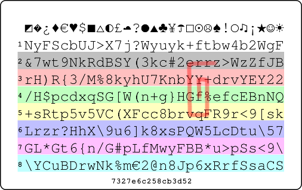
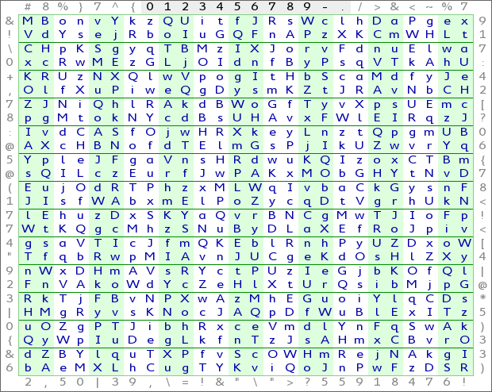
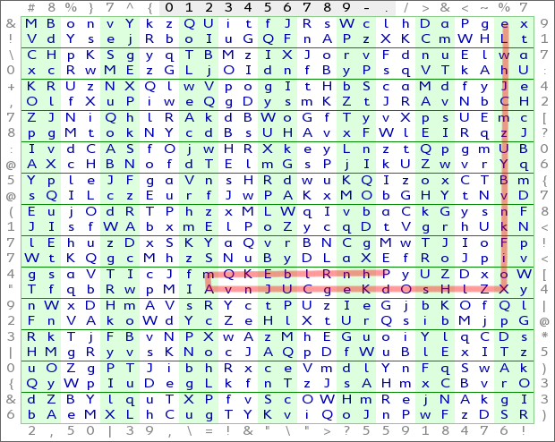
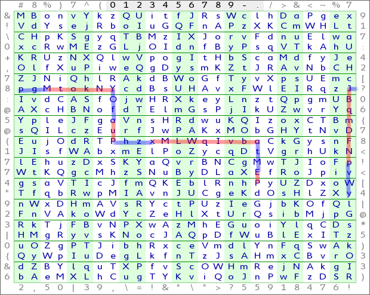

.. include:: <s5defs.txt>

============================
The Mathematics of Passwords
============================

:Author: Aaron Toponce
:Email: aaron.toponce@gmail.com
:PDF: http://ae7.st/s/bi
:Date: 2014-10-21

License
=======

This presentation is licensed under the Creative Commons Attribution-ShareAlike
license.

See http://creativecommons.org/licenses/by-sa/3.0/ for more details.

.. container:: handout
    
    This document is licensed under the CC:BY:SA
    Details to the license can be found here:
    http://creativecommons.org/licenses/by-sa/3.0/

    The licnese states the following:
     * You are free to copy, distribute and tranmit this work.
     * You are free to adapt the work.
    Under the following conditions:
     * You must attribute the work to the copyright holder.
     * If you alter, transform, or build on this work, you may redistribute the
       work under the same, similar or compatible license.
    With the understanding that:
     * Any conditions may be waived if you get written permission from the
       copyright holder.
     * In no way are any of the following rights affected by the license:
         * Your fair dealing or fair use rights;
         * The author's moral rights;
         * Rights other persons may have either in the work itself or
           in how the work is used, such as publicity or privacy rights.
     * For any reuse or distribution, you must make clear to others the license
       terms of this work. The best way to do this is with a link to the web
       page provided above or below.

    The above is a human-readable summary of the license, and is not to be used
    as a legal substitute for the actual licnse. Please refer to the formal
    legal document provided here:
    http://creativecommons.org/licenses/by-sa/3.0/legalcode

Overview
========

* Cryptanalysis
* Password structures
* Strength qualities
* Entropy
* Implementations

.. container:: handout

    The structure of the presentation will be as follows:

    Cryptanalysis: In order to understand what a "strong password" is, we
    need to understand what software is used and how it is used to attack
    passwords. This will help us get a handle on what qualifies a password
    as strong versus weak.

    Password structures: We'll cover how passwords are stored in databases,
    hard drives, and mediums. We'll cover passwords stored in plain text,
    verses hashed passwards, versus salted passwords. Briefly.

    We'll also take what we learned about how they are stored,
    and start looking at the numbers and combinations of passwords. This
    will prepare us for learning about entropy, which is coming up. We'll
    also add rainbow tables to the mix, and why salted passwords increase
    the strength of your password.

    Strength qualities: After analyzing how to attack passwords, we can get
    a sense of what makes passwords strong versus weak. We learn quickly
    that length becomes a key factor as well as adding different character
    sets to the password.

    Entropy: This is to cover the amount of work it takes for an attacker
    to gett access to your account if he knows your username, and is only
    guessing your password. We'll see how length adds much more entropy to
    a password than just adding random characters. We'll run some numbers
    on the time it would take to crack these passwords.

    Implementations: We'll look at some various password managers and how
    you can keep your password safe, while easily accessible at the same
    time.

Password Requirements
=====================

1. "Strong" (whatever that means)
2. Easy to remember
3. Unique for each account
4. Stored securely

.. container:: handout

    We're told that we need to make our passwords "strong", but defining
    what "strong" means seems to confuse people. Some will say that a
    strong password is a long password. Others might say that a password
    uses a combination of lowercase and uppercase letters, numbers and
    punctuation. Others, maybe more anal retentive, will say a strong
    password is one that is built entirely off random characters.

    Needless to say, I think we can do better, and we will. Later on, we'll
    quantify exactly what it means to have a "strong" password

    Having a "strong" password and one that is easy to remember seem to
    conflict each other. The reason for this seems obvious. If I generate a
    "strong" password, then in becomes more difficult to remember. The
    stronger the password it semes, the harder it is to recall from memory.
    So naturally, we want to keep our password easy to remember, so we sort
    of compromise on the strength of the password to accomplish this aim.

    Case in point, and part of the motivation for developing password
    theory; I had a friend who is in the computer science field. He's even
    a mathematician here at Weber State. Recently, he had his Gmail account
    compromised by an attacker. The attacker was able to crack his
    password, and take out the account. The reason the attacker got the
    password was because it wasn't "strong", but instead, easy to remember.
    It was a valuable lesson to him to change his password strength, not
    only for Gmail, but for the other accounts he had.

    Hopefully, I'll be able to show that by the end of this presentation,
    you can have both a very strong password, and one that's easy to
    remember.

    Of course, if a password does get access to the password for our
    account, the last thing we want him to have access to is our bank
    account, or other accounts that we might consider a sensitive nature.
    
    So, it's a good idea to create a unique password for each account that
    we have. However, this also seems to be in disagreement with having
    passwords that are easy to remember. I'm sure each of us have many
    accounts that we interface with. Is it easy to remember which password
    goes with which account? It might be if we interface with those
    accounts daily, but what about the accounts that we only access once a
    month, or even less than that? Forgotten passwords are very common.

    At least having an unique password for each account guarantees that if
    one account gets compromised, the others won't be with that same
    password. Again, hopefully I'll be able to show that not only can you
    have a "strong" password that's easy to remember, but it will be easy
    to remember "strong" passwords for every account you have.

    In reality, passwords are only as secure as their storage, with the
    most secure storage being your brain. However, you can write passwords
    down in a secure manner. You could have an encrypted database with one
    single master password that contains all your account passwords. Unless
    someone knows the master password, they won't get access to the others.
    You could also store your passwords in your wallet or purse, as these
    items are likely the most tracked items in your possession, minus maybe
    your kids.

    There are all sorts of implementations, both software and hardware, for
    storing your passwords securely, and it can be done. We'll look at only
    one method at the very end of this presentation for securely storing
    your passwords.

Cryptanalysis
=============

* Hashing plain text
* Rainbow tables
* Salted password
* Key stretching
* Shadowed password
* John the Ripper

.. container:: handout
    
    In order to get some sort of sense on what makes a password "strong",
    we need to look at the amount of effort it takes to attack a password
    from a cryptanalysis point-of-view.

    Cryptanalysis is a branch of cryptography that studies breaking down
    encrypted data without the access to the secret algorithms that were
    used to generate that encrypted data. These methods use a variety of
    algorithms and theoris, such as birthday attacks, rainbow tables (of
    which we'll talk about here), boomerang attacks, brute force attacks
    and other methods.

    By analyzing some of the cryptanalysis methods used to attack and
    recover passwords from encrypted means will help us get a handle on the
    hardware and software implementations needed to make these attacks
    practical, which means we might get a better understanding what it
    means to have a "strong" password.

    Hashes are one-way algorithms with take any form of data, and produce a
    unique hexadecimal string of characters. If the same data is provided
    to the hashing algorithm, the same hexadecimal string with always be
    produced. This means that there is a one-to-one relationship with the
    data and the hash.

    Hashes are also one-way, meaning that it's trivial to create the hash,
    but we can't go in reverse. In other words, we can't take a hash, and
    reproduce the data that created it. An analogy to this would be creating
    pie crust. It takes water, flour, sugar and other ingredients. It's easy
    to create the dough, and eventually the crust by mixing the ingredients,
    but it's near impossible to take a crust, and reduce it to the
    ingredients necessary to create it. This is partly due to evaporation of
    water during heating in the oven, chemical bonding, and other factors.

    Because the relationship to the data and the hash is one-to-one (1:1),
    this means we could create a database of text that produces the unique
    hash. Although we can't reverse the hash into the data, we can look up
    the hash in the database, and if we find a match, then we know what the
    data is that produced the hash. These databases are known as rainbow
    tables. You can find many large and small rainbow tables on the
    Internet.

    In order to work around tables, passwords are salted. Suppose a password
    is 8 characters long. It contains exactly one unique hash. However, what
    if we were to add a "salt" to the password string. Suppose the password
    salt is 6 characters in length and that the salt is based on a
    64-character set. Then, this means that the password could produce 64^6
    possible hashes. This would make our rainbow table 64^6 times as large.

    64^6 = 68719476736

    If all we have access to is the hash, and not the salt, then we have a
    64^6 possible combinations to search through with the salt, assuming it
    is indeed 6 characters long, to find the right password that produced
    that hash. This makes rainbow tables infeasible.

    Unfortunately, cryptographically secure one-way hashing functions are
    designed to be fast. They are designed to be secure, but they are also
    designed to be fast. As such, this plays to the advantage of the
    password cracker. A simple laptop computer might be able to guess 1
    million passwords per second. It would be nice if we could slow this
    down a bit.

    Key based derivation functions solve this by being computationally
    expensive to derive the key. If my laptop can work through 1 million
    SHA1 hashes per second, I might be able to only work through 20,000
    bcrypt keys. So, some knowledgable of password cracking advocate the
    use of PBKDF2, scrypt(), and bcrypt(). However, you can greatly slow
    down password cracking with one-way hash functions by using key
    stretching.

    Key stretching is the idea that I take a hash of the password, then
    hash that result. I continue in a recursive manner, hashing the new
    output, until X number of times, say 5,000. So, if my wimpy laptop can
    do 1 million SHA1 hashes at the fastest, if I require a key stretching
    of 5,000 rounds, then my laptop must work through 5,000 hashes per
    password. This reduces my effectivenees to 200 passwords per second.
    Key stretching is a great way to slow down the password cracker.

    GNU/Linux supports changing the number of rounds with PAM. By default,
    passwords stored with MD5 are rotated 1,000 times, and passwords stored
    with SHA256 or SHA512 are rotated 5,000 times on GNU/Linux. Mac OS X,
    and the BSD family of operating systems, uses bcrypt() for its password
    storage.

    Further, many passwords in databases and operating systems are
    "shadowed". This means that only the database or operating system
    administrator will have access to the salted password hash. This keeps
    prying eyes of regular system users away from attempting to attack the
    hash, and find the password that produced it. We assume that the
    database and operating system administrators can be trusted, due to the
    nature of their job.

    If we can get access to a shadowed password, then we will also likely
    have access to the salt. This means that we've got enough data to begin
    searching for a string of data that produces the hash (combined with the
    salt appropriately, of course). One such tool to do this is John the
    Ripper. John the Ripper takes an "unshadowed" file, that is the
    username, the salt, and the hashed password, along with some other
    metadata, to begin attacking the password. It does so through brute
    force.

    John the Ripper reads a database of words to attack from, or it can
    start using incremental mode. The "database" of words can be a regular
    text file with one word per line, that is commonly used in spell checker
    programs to assure spelling accuracy. You can also supply options to
    John to reduce the search space, such as restricted character sets,
    suspected password length, and potential dictionary databases to search
    from.

    John the Ripper is designed to be fast. It can take advantage of
    multiple cores in your CPU, to linearly increase the speed. On my 16
    core system at work, I can achieve a speed of 192,000 passwords per
    second. With a cluster of 20 machines, with 16 cores a piece, this means
    I can achieve a speed of 3,840,000 passwords per second.

    For an 8-character password, this means at this pace, it would take 59
    years at most to find the right key, combined with that salt, to match
    the hash given in the shadowed password database. We'll talk more about
    this in a bit.

Some Hashes
===========

* Using the MD5 hash algorithm
* ``foo - d3b07384d113edec49eaa6238ad5ff00``
* ``Foo - cbd8f7984c654c25512e3d9241ae569f``
* ``goo - 7361528e901ca2f2f1952a68ad242d79``

.. container:: handout

    Above is an example of the text 'foo' hashed with the MD5 hashing
    algorithm, compared to hashing 'Foo' and 'goo'. Notice how all the
    hashing strings are radically different from one another. The
    difference of letter case matters, as can be seen with 'f' and 'F'.
    However, the capital letter f compared to the lowercase latter are
    several bytes apart, as far as the computer is concerned. However, the
    letter g is one byte different from the letter f, so you would expect
    the hash to be much more similar, but it's just as radically different.

    As mentioned with hashing algorithms, they are one way functions,
    meaninig that it's asy to take any stream of data, binary or otherwise,
    and get a hash from that stream. However, it should be impossible, or
    highly improbably, to reverse the hash into the originating data.

    Further, hashes should be computationally secure, meaning that it
    should be able to stand against cryptanalysis attacks and there should
    be no collisions in the hash. A collision is given, when many different
    streams of data provide the same hash. Of course collisions will
    occur, due to the infinite nature of the data, and the finite nature
    of the hash output. However, the MD5 algorithm can produce
    5,444,517,870,735,015,415,413,993,718,908,291,383,296 unique hashes.
    This should be large enough to avoid unnecessary or frequent
    collisions.

    Of course, MD5 is horribly broken, but we are using it as an example
    here. Other hashing algorithms increase the search space substantially,
    and some of the more common hashes are given below.

Common Hash Algorithms
======================

* 128-bit: MD2, MD4, MD5, RIPEMD-128
* 160-bit: SHA1, RIPEMD-160
* Others:  SHA224 SHA256 SHA384 SHA512
* SHA3 (Keccak)

.. container:: handout

    Most 128-bit hashes have been shown that computationally feasible
    cryptanalysis can reduce the search space significantly enough to make
    attacks practical. While MD5 is broken, RIPEMD-128 is still considered
    strong enough. Most security experts will advise using at least 160-bit
    or stronger hashing algorithms. The number of unique hashes (the total
    search space) of each hash is given below:

    MD5: 5.44E40
    SHA1: 2.34E50
    SHA224: 4.31E69
    SHA256: 1.85E79
    SHA384: 6.30E117
    SHA512: 2.15E156

Example of a shadowed password
==============================

* ``root:$1$NSESuz4A$22uWH1mOPnka4zTdnx3jx1``

.. container:: handout

    This is an example of a shadowed password from the ``root`` account on a
    Unix server. Each field in the line is separated by a colon. Thus, we
    can break don the line as follows:
    
    ::

        root
        $1$NSESuz4A$22uWH1mOPnka4zTdnx3jx1

    The only data we're going to concern ourselves with is the password
    string:
       
        ``$1$NSESuz4A$22uWH1mOPnka4zTdnx3jx1``
    
    The password is further divided into subfields separated by dollar
    signs. Let's look at each one:

    ``1`` - Tells us the MD5 hashing algorithm is used for the hash.
    ``NSESuz4A`` - Is the salt used with the password for the algorithm.
    ``22uWH1mOPnka4zTdnx3jx1`` - The actual hash of the salted password.

    As you can see, the salt is 8 characters in length. On Unix-like
    systems, the salt uses a character base of ``[a-zA-z0-9./]``. This means
    there are a total of 64 possible characters that each element in the
    salt can be. So, the salt added with the password could produce 64^8 or
    281,474,976,710,656 total passwords.

John the Ripper
===============

* http://www.openwall.com/john/
* Available for Windows, Mac OS X, GNU/Linux and UNIX
* Free of charge
* Free and Open Source Software
* Wordlists available in 20+ languages containing 4 million entries
* Supports multiple processors

.. container:: handout

    John the Ripper is a utility for cracking passwords. It takes a
    wordlist and an unshadowed password dababase file, and attempts to
    recover the password by hashing the entries in the word list and
    matching them to the entry in the unshadowed password file.
    
    As we already discovered, the shadowed password contains a bit of
    information. It shows is the hashing algorithm used to create the hash,
    it gives us the salt that is combined with the password, and of course
    it gives us the hashed password.

    When john gets an entry from the wordlist, it looks for the hashing
    algorthim it needs to use on this account, grabs the salt, combines the
    salt and the wordlist entry together, hashes the combined result, and
    compares that hash to what is in the unshadowed file. If the hash
    matches, then we have found our password. If it doesn't match, then we
    continue working our way through the wordlist in a like manner until we
    find a match.

    If we exhaust the word list and haven't found a match, then john will
    go into incremental mode, meaning it will start with 'a' then 'b'
    through 'z', then try 'aa', 'ab' through 'zz', then 'aaa' etc until a
    match has been found.

    John can take advantage of a multiple CPU/core system. It's trivial to
    have one CPU/core work on one wordlist, a different CPU/core work on a
    different wordlist, etc. Hashing the text is the most computationally
    intensive operation, so you could have different CPUs/cores working on
    hashing texts of different lengths. John is very configurable, with
    many more options, to speed up the process for searching for passwords.

    Wordlists can be obtained from the developers of John the Ripper.
    Relatively small wordlists are given away for free, while a nominal
    charge is required for larger wordlists. Other wordlists aronud the
    Internet could be found, the largest of which might contain 2-3 million
    entries. Of course, your operating system likely already ships with a
    wordlist that spellcheckers use as their dictionary database. Check
    the documentation for your operating system for more information.

Passwords From Weak to Strong
=============================

* Dictionary words
* Number appended
* Predictable sequences (from keyboard, etc.)
* Predictable "l33t" speak
* Personal data
* Mnemonics (``BBslwys90!?``)
* Random base-95 strings

.. class:: handout

    Some points to address in this list. Obviously, we covered why
    dictionary words are a bad idea, words with numbers appended,
    predictable sequences, such as from the keyboard or repeating
    characters and words in the password and even predictable "l33t" speak
    doesn't award you much strength.

    The only item in that list that would deserve some mention are
    Mnemonics, such as ``BBslwys90!?`` from ``B1gbRother|$alw4sriGHt!t?``.
    Notice that we substituted "90", a right angle, for the word "riGHt".
    If used correctly, this creates a random string of characters that are
    meaninful to you, but the attacker would not be able to guess. These
    need to be used with care, as common phrases turned to mnemonics could
    be easy to guess.

Entropy
=======

* Total possible number of states a password can be in.
* Represented in base-2.
* Increasing the entropy of a password increases its strength.

.. container:: handout

    Entropy comes from information theory, where entropy is a measure of
    the uncertainty of the random variable. In essence, entropy quantifies
    the expected value of information contained in a message.

    For example, a fair coin has a entropy value of one bit. However, if
    the coin is not fair, then the expected value is lower, due to the
    uncertainty being lower. The entropy of a coin flip is given by the
    binary entropy function.

Calculating Entropy
===================

* Comes from the total possible combinations: ``y = b^x``
* Defined as: ``H = L*log2(N) = L*log(N)/log(2)``
* H = number if bits in base-2
* L = length of the message
* N = number of possible symbols in the password
* See table in handout

.. container:: handout

    Calculating entropy comes from calculating the total number of
    combinations giving a set of objects and a length. For example, suppose
    you want to generate a password with 8 characters using only lowercase
    alphabetic characters. Then you have;

        ``_ _ _ _ _ _ _ _ = 26*26*26*26*26*26*26*26 = 26^8 = 208,827,064,576``

    As such, there are approximately 208 billion total passwords using only
    lowercase alpahbetic characters of 8 characters in length.

    However, how unpredictable could each password be from the other? This
    is measured in bits, and we need to do some maths. Let y = possible
    combinations, b = each individual character, and x = length of the
    password. Then:

        ``y = b^x``

    Easy enough. Let's manipulate it a bit. Taking the log of base-b on
    both sides gives us:

        ``log_b(y) = x``

    Using a property of logarithms, we can change the base. Because Claude
    Shannon defined entropy in binary bits, or base-2, we get:

        ``log_b(y) = log_2(y)/log_2(b) = x``

    So, going back to our example of an 8 character string with only
    alphabetic characters, we get:

        ``log_26(y) = log_2(y)/log_2(26) = 8``

    Thus:

        ``log_2(y) = 8 * log_2(26)``

    Let ``H = log_2(y)``, or our entropy estimate. Then:

    ::

        H = 8 * log_2(26)
          = 8 * log(26)/log(2)

    Or, generically speaking:

    ::

        H = L*log2(N)
          = L*log(N)/log(2)

    where H is the resultant entropy of the password given in binay bits, L
    is the length of the password and N is the number of possible symbols
    in the password.

    For example, the password ``BBslwys90!?`` has a length of 11. It also
    uses characters from the lowercases character set, uppercase character
    set and the number and "special character" character sets. So, N=94, in
    this case. Thus 11*log2(94)=72. This password has an entropy of 72
    binary bits.

    What this means is that a brute force password cracking utility would
    have a search space of 2^72 or 4,722,366,482,869,645,213,696 possible
    passwords to search through for a 72-bit entropy password. Of course,
    understanding probability means that the utility won't have to search
    every password in the search space. It should stop when the password is
    found, even if there are more passwords remaining.

    Consider the following table:

.. class:: table
    :class: handout

    ============= ========= ========== ============== ======================
     Entropy (H)   Numbers   Alphabet   Alphanumeric   All ASCII characters
    ============= ========= ========== ============== ======================
        32           10          6           6                 5
        40           13          8           7                 7
        64           20          12          11                10
        80           25          15          14                13
        96           29          17          17                15
        128          39          23          22                20
        160          49          29          27                25
        192          58          34          33                30
        224          68          40          38                35
        256          78          45          43                40
        384          116         68          65                59
        512          155         90          86                79
        1024         309         180         172               157
    ============= ========= ========== ============== ======================

.. container:: handout

   Looking at the table above, the "Entropy (H)" column shows the desired
   bit strength that you wish your password to have. For example, suppose
   you wanted your password to have a bit strength of 80. Then, if your
   password consisted of only numbers, it would need to be 25 digits long.
   If you wanted your password to consist of all chracters from the entire
   ASCII character set, then you would only need a password of 13
   characters for 80 bits of entropy.

How Much Entropy?
=================

* Need sufficient entropy to withstand a sophisticated attack.
* Should withstand the most wealthy organizations.

.. container:: handout

    The only concern here now should be how much entropy should be behind
    your password? Think of it like searching for a needle in a haystack.
    Your password is the needle, why the haystack is the keyspace measured
    in entropy. The more entropy, or larger your haystack, the harder it
    will be to find the needle.

.. class:: table
    :class: handout

    ======== ================================ =========================
     Length   Search Space                     Max at 350 Gpps
    ======== ================================ =========================
      8       6634204312890625                   5.3 hours
      9       630249409724609375                 20.8 days
      10      59873693923837890625               5.4 years
      11      5688000922764599609375             5.1 centuries
      12      540360087662636962890625           48.9 millenia
      13      51334208327950511474609375         4,650.1 millenia
      14      4876749791155298590087890625       441,830.6 millenia
      15      463291230159753366058349609375     41,973,910.1 millenia
    ======== ================================ =========================

Putting Entropy Into Perspective
================================

* http://distributed.net
* Cracking 72-bit entropy key
* $1000 for the winner
* 420,865,681,244 keys per second
* ~235 years max to exhaustion

.. container:: handout

   My personal opinion would be that your password should contain at least
   60 bits of entropy. This will provide enough entropy to make your search
   space large enough to frustrate most attackers, even with very dedicated
   hardware, or a distributed attack.

   However, as computing strengthens and newer, faster algorithms are
   discovered, this isn't enough. Eventually, you well need 72-bits of
   entropy then maybe 80-bits. So, the question remains, as time goes on,
   how can you manage passwords with this much entropy?

Another Distributed Computing Project
=====================================

* Bitcoin mined using SHA256(SHA256(header))
* Measured in "Hps" or "hashes per second"
* Approximately 250 million GHps = 250 quadrillion Hps
* https://blockchain.info/charts/hash-rate

.. container:: handout

    Bitcoin mining is done by a distributed set of clients donating CPU,
    GPU, or ASIC processing power to solve a puzzle. The puzzle is taking
    the double SHA256 hash of a Bitcoin header candidate, and evaluating
    its output in binary. If the output meets some certain restrictions,
    then a valid header and the resulting Bitcoin has been found. As more
    Bitcoin is mined, the difficulty in solving the puzzle increases until
    all 21 million Bitcoin have been mined.

    Currently, approximately 250 quadrillion hashes per second are being
    calculated. This is a 2.5x increase since the beginning of the year,
    and it's continuing to increase at an exponential rate.

Some Bitcoin Entropy Values
===========================

* 72-bits @ 2.5E17 ~= 5 hours 15 minutes.
* 80-bits @ 2.5E17 ~= 56 days.
* 88-bits @ 2.5E17 ~= 39 years.

.. container:: handout

    Operating at about 250 million gigahashes per second, or about 250
    petahashes per second, which is 250 quadrillion hashes per second. A
    72-bit entropy password has a space of:

        ``2^72 passwords = 4,722,366,482,869,645,213,696 passwords.``

    At a pace of 250 quadrillion passwords per second, it would take:

        ``2^72 passwords / (2.5*10^17 passwords/sec) ~= 5h 15m.``

    So, that sucks. Of course, I don't know of any single entity or
    organization that has anywhere near that processing power. If they did,
    they could claim the coveted 51% of the blockchain. Regardless, let's
    see what 80-bits of entropy looks like:

        ``2^80 passwords / (2.5*10^17 passwords/sec) ~= 56 days.``

    On more. Let's look at 88-bits:

        ``2^88 passwords / (2.5*10^17 passwords/sec) ~= 39 years.``

    So, it seems like 72-bits actually isn't that bad. Maybe a bit on the weak
    end, but 80-bits seems safe enough, and 88-bits on the upper end of what
    the entire Bitcoin mining network could accomplish brute forcing all
    the possible passwords.

    I can't say for 100% certainty, but I would wager that no single entity
    or organization on Earth has anywhere near the processing power of
    Bitcoin mining. The fastest supercomputer has a theoretical peak of 54
    TFlops/s, or about 1/50 that of the Bitcoin mining network, and it's
    sucking through 17 mW of power to achieve that pace.

Humans Suck At Passwords
========================

* A password must contain great amounts of entropy.
* A password must be truly random.
* Humans are not allowed to influence password generation.

.. container:: handout

    Due to all the password leaks over the years, and the success rate of
    password cracking to restore the original password, it has come to my
    conclusion that humans suck at creating passwords. The only secure
    passwords are those that are chosen using true random and unpredictable
    events. Until password cracking becomes horribly inefficient, and a
    waste of valueable time, humans should have no influence on the choice
    of the password.

True Random Offline Password Generators
=======================================

* Diceware
* The PasswordCard
* Off The Grid

.. container:: handout

    The following password generators can be utilized offline, meaning the
    computer isn't generating the password, although it may have generated
    tools for creating the passwords.

    Diceware is a list comprising of 7,776 words which is the total number
    of combinations from 5 fair 6-sided dice. Each word has a look up
    number that corresponds to the dice roll. For example, if you rolled
    "44311", then your first word from the word list would be "oint". I say
    "first word", because you now need to make another roll. You need to
    continue rolling until your passphrase contains at least 80-bits of
    entropy, as we previously determined.
    
    The PasswordCard is a GPLv3 web application that generates a small
    credit-card sized card that you can fit into your wallet for password
    generation. The way you would generate a password is simple. Suppose
    you wanted to generate a password for an online account, such as an
    email provider. You could pull out your PasswordCard, determine a
    starting location, a direction, and a length, and use the resulting
    characters for your password. Because the PasswordCard is a
    two-dimensional table of characters, the direction of your password can
    take any direction, such as left, right, up, down, diagonally, spiral,
    or any combination of directions. Because the length of your password
    can theoretically be infinite, so too would be the search space, if
    someone were to get access to your card.

    Off The Grid is a paper-based cipher for encrypting domain names. The
    concept is built around the idea of using Latin Squares as a means for
    creating the cipher. Off The Grid is a 26x26 Latin Square using the
    English alphabet. In other words, any character appears only one in any
    given row and column. As a result of the Latin Square, words can be
    traversed throughout the square, alternating rows and columns.

Diceware 
=========

* Five fair 6-sided dice
* 7,776 word list
* 12.9-bits of entropy per word
* Variation 1- Portable Diceware
* Variation 2- Dictionaryware
* Variation 3- Coinware
* Dice Considerations

.. container:: handout

    Because there are 7,776 possible words in the word list, then each word
    contains about 12.95 bits of entropy. This means you will need to roll
    your 5 dice seven times (six rolls will only produce 77.7-bits of
    entropy) to achieve the minimum. Starting with my first word, and
    rolling six more times, here are the results of my dice rolls:

    ::

        44311 oint
        12115 alum
        16335 cg
        64566 xs
        22213 cut
        43221 mutt
        53143 scar

    Or, "ointalumcgxscutmuttscar", which is 23 total characters in length.
    This is a semi-lengthy password, no doubt, but it meets our criteria to
    be truly random and contains sufficient entropy. Further, because the
    word list can be printed, you can generate secure, and strong passwords
    without the aid of a computer.

    Carrying around a word list of 7,776 words might not be very practical.
    After all, if you store it in your wallet, assuming you can hold
    something about 10-by-30 characters on each side of a card, you would
    need to print close to 175 cards to fit all the Diceware word list.
    This just isn't practical. You could store the word list as a PDF, and
    carry it on your phone, but not everyone has a phone capable of
    installing a PDF reader, and we're trying to achieve this without the
    aid of any computing device. Let's dig further.

    For carrying around only one or two cards in your wallet, we'll need to
    generate some tables. Thankfully the tables are small, and you can
    still generate secure passwords. Unfortunately, the passwords will not
    be as easy to remember as using the original word list. Consider the
    following table:

    ::

        If first roll=1 or 2               3 or 4               5 or 6
                   Second Roll          Second Roll          Second Roll
                 1  2  3  4  5  6     1  2  3  4  5  6     1  2  3  4  5  6
        
        T  1     A  B  C  D  E  F     a  b  c  d  e  f     !  @  #  $  %  ^     
        h  2     G  H  I  J  K  L     g  h  i  j  k  l     &  *  (  )  -  =
        i  3     M  N  O  P  Q  R     m  n  o  p  q  r     +  [  ]  {  }  \  
        r  4     S  T  U  V  W  X     s  t  u  v  w  x     |  `  ;  :  '  "
        d  5     Y  Z  0  1  2  3     y  z  ~  _  sp       <  >  /  ?  .  ,
           6     4  5  6  7  8  9

    In this case, I will only need 3 fair 6-sided dice (or 1 fair 6-sided
    die rolled three times), rather than 5. Suppose I roll "614". The "6"
    means I would use the third table. The "1" means the first column in
    the third table, and the "4" is the fourth row in the 1st column of the
    third table, or "|". All 94 printable ASCII characters, plus the space,
    are represented in these tables. Each character gives about 6.57-bits
    of entropy, which means you would only need to roll your 3 fair 6-sided
    dice thirteen times to get enough entropy to meet our requirement for
    at least 80-bits of entropy.

    As an example, consider the following rolls:

        ``614 622 224 461 424 155 565 113 255 322 136 631 544``

    This would produce:

    ::

        614 |
        622 *
        224 T
        461 f
        424 t
        155 2
        565 ,
        113 M
        255 2
        322 h
        136 6
        631 #
        544 :

    Or ``|*Tft2,M2h6#:`` as our password. This password contains 85.41-bits
    of entropy, and was created at random. The characters "sp" represent
    the ASCII space. If you reach a table blank on any of your rolls, such
    as rolling "616", or "365", just roll again.

    If you only need to create a password that uses just letters and
    numbers, then you only need to use the first table, and you only need
    two dice. However, each character only gives about 5.17-bits of
    entropy. As such, we would need a 16-character password to achieve our
    80-bits minimum.

    There are other variations on the tables with dice that you can use,
    such as generating random hexadecimal strings, random decimal numbers,
    special characters, and other requirements. See the Diceware FAQ for
    more information.
    
    While carrying around a word list in your wallet or purse might not be
    practical, you may have a dictionary in your bookshelf, or the place
    you are visiting might have a dictionary you can borrow. The tricky
    part about dictionaries, however, is determining your search space, so
    you can accurately calculate entropy. Thankfully, we just need to put
    on our thinking caps, do a bit of math, and we can arrive at a good
    number.

    My Merriam-Webster Dictionary contains approximately 57,000 defined
    words, across 820 pages of printed text. This averages to 70 dictionary
    words page. Each page is divided into two columns, which gives me about
    35 dictionary words per column. I'll use the same 5 fair 6-sided dice I
    used in my initial Diceware. Because my dictionary book contains 3
    numbers for its page number, the first 3 dice will tell me the page
    number of the dictionary. The 4th die will tell me which column the
    word will come from; if the die is odd (1, 3, or 5), the first (left)
    column is used, if the die is even (2, 4, or 6), then the second
    (right) column is used. The 5th die will tell me the word in that
    column, which means only using the first 6 words in each column.

    As an example, if my roll was "56351", then I would turn to page "563",
    use the first column on the page, and the first word, which is
    "Pullman".

    Obviously, there are a great number of pages skipped, and a lot of
    words skipped. To understand how much entropy each word provides, I
    need to figure out how many words are available given my limitations
    with 6-sided dice. First, the following pages in my dictionary are
    skipped:

    ::

        1-110 (a-calm)
        167-210 (convolution-disgust)
        267-310 (festoon-GQ)
        367-410 (inhale-litigious)
        467-510 (natty-patchwork)
        567-610 (QM-rumble)
        667-820 (stab-zymurgy)

    That's a total of 484 pages eliminated from the book, which means I
    only have 336 valid pages to use. Because I can only choose the first 6
    words from each column, or 12 words per page, that gives me 4,032 total
    words available to pick from. As such, each word provides about
    11.98-bits of entropy, which means I need at least 7 words from my
    dictionary to reach my 80-bits entropy minimum for my passphrase.

    As an example, if I use my rolls that I used at the beginning of this
    post, then my result would be:

    ::

        44311 midday
        12115 castled
        16335 constancy
        64566 skew
        22213 drag
        43221 maunder
        53143 plantain

    Or "middaycastledconstancyskewdragmaunderplantain". That's 45
    characters in length, which is rather lengthy to achieve the minimum
    amount of entropy as our initial Diceware roll at the start of this
    post. This is due to the possibility of words in the English language
    being longer than 7 characters, which doesn't exist in our Diceware
    list. As such, you will likely get longer passphrases using an English
    dictionary versus using the Diceware list.

    Some points to take into consideration when using "Dictionaryware":

    Different dictionaries will need to be adjusted as necessary to
    accommodate the number of pages, and the number of columns. You just
    need to make sure that the dice are picking the word, and not you. If
    your dictionary is smaller than 600 pages, you may need to come up with
    a system handling the numbers 0, 7, 8, & 9 to get sufficient entropy.
    Additional dice rolls or a look up table could work, but it complicates
    the process.

    Some dictionaries might define a word two, three, or times, based on it
    being a noun, verb, adjective or abbreviation. This will reduce our
    total search space, which will reduce our entropy per word. So, in my
    example of 11.98-bits of entropy per word, this is a maximum. It may
    require a bit more work to determine a more accurate entropy estimate.

    Even carrying around dice can be impractical. However, it is much more
    likely that you are carrying around spare change in your pockets, or
    have some sitting in a desk drawer at work. Provided that the coin
    flips fairly between heads and tails, you can flip a coin to build your
    passphrase.

    Preferably, you'll want to use 3 separate coins (penny, nickel, dime),
    but if you only have a single penny, or 3 pennies, that will work too.
    The idea is that you toss the three coins, which will identify a single
    throw of a die. So, 15 coin tosses will determine your 5 dice rolls.
    Using Coinware requires the following look up table:

    ::

              Results of Coin Toss
              Penny Nickel Dime
         
        D  1    T     T     T
        i  2    T     T     H
        e  3    T     H     T
           4    T     H     H
        R  5    H     T     T
        o  6    H     T     H
        l  *    H     H     T
        l  *    H     H     H

    If your coin tosses produce a "*", re-flip your coins. As such, to get
    the dice roll of "44311", I would have needed to get the following coin
    flips:

    ::

        THH 4
        THH 4
        THT 3
        TTT 1
        TTT 1

    This would produce my word "oint" from the Diceware word list. I would
    then need to proceed six more times to get my seven words necessary for
    reaching my 80-bits of entropy minimum. If you think that flipping 3
    coins for 1 die roll is a lot of work, you're right. It is. You would
    be better off getting some dice.

    I would be amiss if I didn't mention something about the randomness of dice
    itself. No doubt, dice can be loaded, imbalanced, burned, and/or lopsided
    to favor certain sides. For obvious reasons, you should avoid using "bad
    dice" when generating your Diceware passphrases. You want random to be on
    your side as much as possible (you want a "strong password", don't you?).
    Every side of each die should be equally as likely as the other five sides.

    Unfortunately, "gaming dice" that you get from your local hobby store, or
    that come with board games, aren't fair 6-sided dice. But, they're probably
    "good enough". In other words, one die may favor a "4" due to imperfections
    in the die material, weighting it on the "3", while another die may favor a
    "6", because it has had more material drilled out of it than the "1".
    Finally, one die may have a more chamfered corner or edge than the rest of
    the corners or edges, slightly favoring a specific number or pair of
    numbers. Taking these imperfections, and the position the dice fall with
    respect to the others will probably give you enough randomness as to not be
    repeatable from throw-to-throw.

    If you want to see if your dice favor numbers, get a tall cylinder, such as
    a large water bottle. Fill it with water, and drop in your die, then seal
    off the top. The die will sink to the bottom. Turn over the cylinder, let
    the die drop to the bottom, and record its number. You should do this at
    least 30 times for a decent sample size. In fact, the larger the sample
    size, the more accurate the results. Each number should come up 1/6 of the
    time, for that die. See Playing Fair with the Chi Square Test of
    Homogeneity for more information about testing fairness in dice.

    However, there are "precision dice", or "casino quality dice" which are
    guaranteed to have each number equally as likely as the other six within a
    .0001 margin of error between any two numbers (in other words, if you threw
    the die 10,000 times, a favored number would come up 1 more time than
    another). If you live close to a casino, you can probably purchase used
    casino dice on the cheap. Even though the corners and edges will be
    slightly chamfered, thus beginning to show slight favoring in numbers, they
    are still likely more "fair" than your store-bought dice, and will probably
    continue to exhibit more fairness in each throw for a good long while.

    If you search for "precision casino dice", you will find some listings on
    Amazon, eBay, and other locations. Most of these dice have razor edges and
    corners, meaning they are not rounded, and the corners are sharp. As such,
    the dice don't "roll" as well as dice purchased from a hobby store. They
    tend to land with a solid fall on the number. This also means they won't
    roll off your table when throwing them. Many of these dice will be
    transparent, so you can see the pip depth, and will also have a serial
    number printed on the die if purchased in a set. These dice are more
    expensive, but they will be the best choice in choosing fair 6-sided dice.

    Rix Dice are precision machined metal dice, with chamfered corners and
    edges for better rolling. They'll last longer than acrylic or plastic dice,
    and the creator, Amber Rix, has paid attention to the dice being fair. They
    might be a consideration, if you plan on rolling them a lot. They are the
    most expensive precision dice I've come across, but probably the most
    durable too.

The PasswordCard
================

* http://passwordcard.org
* Uses an hexidecimal number for generation/regeneration
* Print and store in wallet/purse
* Use passwords provided on card
* Remember column/row, direction, length
* 5.78-bits of entropy per character for alphanumeric
* 6.25-bits of entropy per character for alphanumeric plus symbols

.. container:: handout

    The password card from http://passwordcard.org is a way to generate
    strong passwords with high entropy, make the password easy to remember,
    have a unique password for each account that you have, and store the
    passwords in a secure place; namely your wallet or purse.

    When you visit the site, you will be presented with a form at which you
    enter a valid hexadecimal number. It doesn't have to be something
    complicated. If you recognize that the integers 0 through 9 are valid
    hexadecimal numbers, then a number such as '42' would works just fine.
    Also ,the letters a through f are valid hexidecimal numbers, so
    something like 'dead', 'beef' and 'cafe' are all valid hexadecimal
    numbers as well.

    The point of the hexadecimal number is just in case you lose the card,
    you can regenerate it with that number. This means that there exists
    only one card for each number provided. The valid input range for the
    hexadecimal number is anything from 0 to ffffffffffffffff, which means
    you could generate up to 295,147,905,179,352,825,856 password cards.

    Once the card is generated, print it off, laminate it, and throw it in
    your purse or wallet. Now, when you need a password for creating an
    account, or wish to change existing passwords, pull out the card, find
    a symbol column and row color that will help you remember the starting
    location for the password, and go. Pick your destination and password
    length. Then, everytime you need the password, just pull out your card,
    and type it in. Eventually, if you use the password often enough.
    you'll begin memorizing the password.

    The PasswordCard uses the following character sets when generating a
    card on the site:

    ::

        alphanumeric:
            23456789
            abcdefghjkmnpqrstuvwxyz
            ABCDEFGHJKLMNPQRSTUVWXYZ

        alphanumeric plus symbols:
            23456789
            abcdefghjkmnpqrstuvwxyz
            ABCDEFGHJKLMNPQRSTUVWXYZ
            @#$%&*<>?€+{}/\

        numeric: 
            0123456789

    As such, you can expect the following entropy sizes per character when
    creating a card:

    ::

        Alphanumeric (55 unique characters): 5.78-bits.
        Alphanumeric plus symbols (76 unique characters): 6.25-bits.

    When checking the box "check this for an area with only digits", it
    doesn't change the search space for the already existing alphanumeric
    output that is default when loading the page. It only creates 4 rows of
    digits for easy PIN generation. Your entropy per character is only
    increased when checking the box "check this to include symbols".

    To generate a password, you would need to pick a starting location for your
    password. You'll notice that there are 29 columns and 8 rows. The columns
    are identified by symbols, while the rows are identified both by a color and
    a number. For each account, all you need to remember are 3 things:

        * The starting location (should be different for every account).
        * The direction (should be the same for each account).
        * The length (should be the same for each account).

    As a strong suggestion, whatever direction and length you take for your
    passwords, you should keep them consistent. If you decide to do a
    13-character clockwise spiral for one account, you should do a 13-character
    clockwise spiral for all of your accounts. The only thing changing is the
    location of the password. This will greatly simplify identifying each
    password for each account. If you change up the lengths and directions, and
    well as the starting location for each account, you run the risk of having a
    very difficult time finding the correct password for that account. If your
    brain has that mental capacity, then the more power to you. Otherwise, I
    would keep it consistent.

    The nice thing about the PasswordCard, is that all of your passwords are
    already written down for you in plaintext. However, if a password cracker
    were to get access to your card, they would need to know which starting
    location belongs to which account, the direction the password takes, as well
    as the length of the password. This is too many variables for an attacker to
    make efficient use of his time. His time would be better spent taking the
    character sets off of the card, and building an incremental brute-force
    search. Provided your password has sufficient entropy, you will likely
    thwart the attack.

    There are a couple disadvantages with the PasswordCard, however. The first
    is that this is not well suited for the blind. Unlike Diceware, which can be
    easily adapted for the blind, this is a bit more of a challenge. While I'm
    not asserting that it's impossible, it certainly seems difficult to
    practically reproduce. The second disadvantage is the use of the "€" euro
    symbol. The PasswordCard is developed by a Java developer in the Euro Zone.
    While it makes sense for him to include the character, it alienates those
    that don't easily have access to it on their keyboards, such as those using
    the basic ASCII character set. As such, you may want to refresh your
    browser, generating random cards until you find one without the "€"
    character in its output.

    Lastly, you will definitely want to print a second card, and keep it
    somewhere safe as a backup, should you lose the original. Keeping the card
    in your wallet or purse makes the most sense, as your wallet or purse is
    likely the most protected object in your possession, next to your phone and
    keys. But, should you lose the card, you will want to get access to your
    passwords, which will mean getting access to your backup copy.

    I personally like the PasswordCard. It's simple, small, and doesn't require
    me to carry a lot of items with me, such as dice and a large word list. My
    only concern is being able to choose a new starting location for each
    account. I'm not as random as I would think when finding a starting
    location, so I wrote a script to handle that for me. But it's clean, out of
    the way, and works really well. When I don't have an account password
    memorized, I can pull out the card, remember where it starts, and just start
    typing. Generation is quick, and remember password locations is easy. Highly
    recommended.

Sample PasswordCard
===================

Possible PasswordCard Paths
===========================

Off The Grid
============

* https://www.grc.com/offthegrid.htm
* Encrypts domain names using paper.
* From security researcher Steve Gibson
* Built around the concept of Latin Squares
* 6.59-bits of entropy per character

.. container:: handout

    Off The Grid is a paper-based cipher for encrypting domain names. The
    concept is built around the idea of using Latin Squares as a means for
    creating the cipher. Off The Grid is a 26x26 Latin Square using the English
    alphabet. In other words, any character appears only one in any given row
    and column. As a result of the Latin Square, words can be traversed
    throughout the square, alternating rows and columns. This will be explained
    further.

    Outside of the grid are numbers and non-alphabetic characters. These are
    used as an additional resource when creating the passwords for your sites.
    Because the grid itself is a randomized mixture of lowercase and uppercase
    letters, the grid itself has an entropy of approximately 5.7-bits per
    character. The outer border consists of the following characters:

        ``0123456789!"#$%&'()*+,/:;<=>?@[$$^{|}~``

    As such, if using the border to build your passwords, then you have access
    to 90 total unique characters, bringing your entropy to approximately
    6.59-bits per character.

    Because we determined that 80-bits of entropy should be the minimum when
    generating passwords, if your password consists of only the alphabetic
    characters in the grid, then you should aim at building at least
    15-character passwords. If you are including the outer border in your
    password building, then a 13-character password should be the target.

    The grid and border are randomized, minus 12 characters in the center of the
    top border, so the resulting password is a true random password that can be
    used for your accounts. Thus, the requirements to build a truly random
    password with at least 80-bits of entropy is achieved.

    Off The Grid is a finite state machine. This is achieved by traversing the
    grid from a starting location to an ending location, the rules of which will
    be described here. After reaching your first ending location, a second
    traversal is made starting from the first ending location, and ending at a
    new location. There are exactly 26^2 or 676 states in the Off The Grid
    system.

    In Steve's instructions for building passwords using the grid, you take the
    first 6 characters of the domain name, and build a resulting password of 12
    characters- 2 ciphertext characters for each 1 plaintext character.
    Unfortunately, as we demonstrated, this doesn't provide us with enough
    entropy to withstand offline database attacks. As such, I would look at what
    you want for your target password length. If it's 15 characters, then I
    would take the first 5 characters of the domain name, and use a ratio of 3:1
    rather than 2:1 when building the password. If you want a 16 character
    password, then you could use the first 4 characters of the domain name, and
    use a ratio of 4:1, or you could take the first 8 characters of the domain
    name, and use a ration of 2:1. Keep this in mind, because from here on out,
    it gets challenging, and you'll need your ratio for later.

    Off The Grid can be described in the following steps:

    * You are always using the domain name for building your passwords.
    * Determine how many characters from the domain name you will need to build
      your password.
    * Find the first character of the domain name in the first row.
    * Find the second character of the domain name in the column below the first
      character.
    * Find the third character of the domain name in the row of the previous
      character.
    * Alternate rows and columns until you reach the last character of the
      domain name.
    * Starting at your new position, find the first character of the domain name
      in that row.
    * Overshoot in that row by the ratio you determined before. If your ratio is
      2:1, overshoot 2 characters. If your ratio is 4:1, overshoot 4 characters.
    * Write down the characters you overshot with. These will build your
      password.
    * Now at your new overshot position, find the second character of the domain
      name in the column below the overshot character.
    * Overshoot in that column by the ratio you determined before.
    * Write down the characters you overshot with.
    * Continue alternating rows and columns, overshooting by your ratio, and
      writing down the overshot characters until you've traversed the domain
      name
    * You now have your password.

    For choosing your password, you can let the OTG help. In this case, some
    sites do not allow non-alphanumeric characters in the password. In other
    words, it's letters and digits only. Part of the border pattern is that
    there is exactly one digit in the border for every row and every column. So,
    rather than overshooting to a non-alphanumeric character, you could just use
    the number in that row or column instead. This way, our previous password
    would be "Mt5bA1oQ7cZ7IA2".

    You could tack something onto the beginning or end. Of course, you could
    always just tack a special character or two at the beginning or end of the
    password. Your logic for how this is accomplished is up to you. You could
    use the beginning row/column border character in phase-2, or the ending
    row/column border character. Whatever makes the most sense for you.

    Unfortunately, some domains have non-alphabetic characters in their domain
    name. Although seldom, they do exist, and OTG can't completely rule out the
    possibility that they will not be encountered. As such, in the center of the
    top border are 12 characters- the digits 0 through 9, the period and the
    dash. If these characters are encountered as part of traveling through the
    OTG with the domain, then travel to the character in the first row
    immediately below that character in the same column. For example, if your
    domain had a "5" in the domain, then you would travel to "f" in the first
    row in our example OTG card. If there are consecutive numbers in your
    domain, then unfortunately, I am not sure exactly how that is to be handled.

    If you have made it to this point, you're determined to learn OTG. In my
    opinion, Steve's OTG paper system has some pretty serious problems:

    * The rules are technical and many, making the entire system very cumbersome
      to use.
    * Overall, creating your passwords are slow, slow, slow. Hopefully you store
      them in an encrypted database for retrieval, because recreating them is
      very slow, and not something you want to be fighting with when under
      stress.
    * Due to the cumbersome nature of OTG, creating your passwords can be very
      error prone.
    * The size of the OTG card is too large to fit into your wallet to carry
      with you, and see the characters on the grid without a magnifying glass.
    * If the card is lost, and the card is attributed to you, because you are
      using domains to create the passwords, the attacker could easily figure
      out the password to your accounts with the card. As such, you may want to
      prepend a 1- or 2-character salt onto the domain before beginning phase 1.

    These are probably my biggest criticisms of the OTG system. While slick
    for a paper-based encryption system, it's a lot of visual scanning and
    lookups, a lot of rules and exceptions to remember, and a lot of areas
    that can create errors. Some die-hards may use this for their
    passwords, but I don't think I can recommend it, even to some of the
    most nerdy, security conscious friends I have.

    To be fair, the OTG system is marked as "Work in Progress", so there
    may be adjustments to the system in the future that make it more of an
    elegant system for creating passwords. But I think the whole thing will
    need to be reworked, as traversing a Latin Square to create passwords
    is just too cumbersome for practical use.

Off The Grid Example Card
=========================

Off The Grid Phase 1
====================

* For "examp" from example.com
* Alternate rows and columns

Off The Grid Phase 2
====================

* Repeat Phase 1
* Overshoot by 3 characters

Conclusion
==========

* Comments?
* Questions?
* Rude Remarks?
