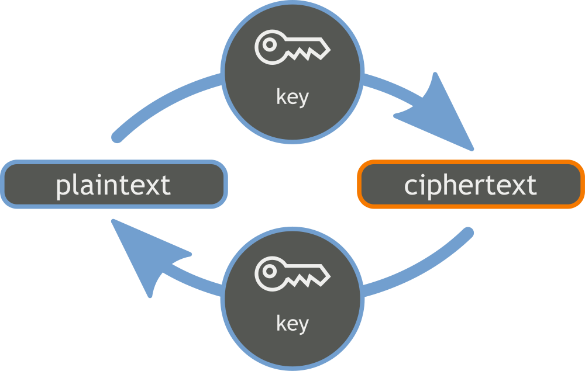
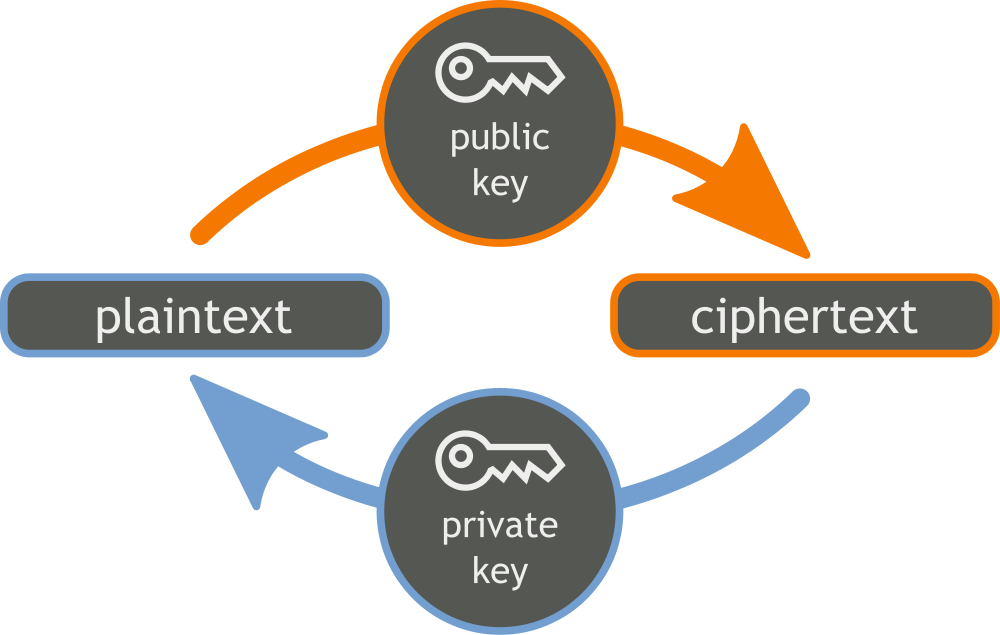
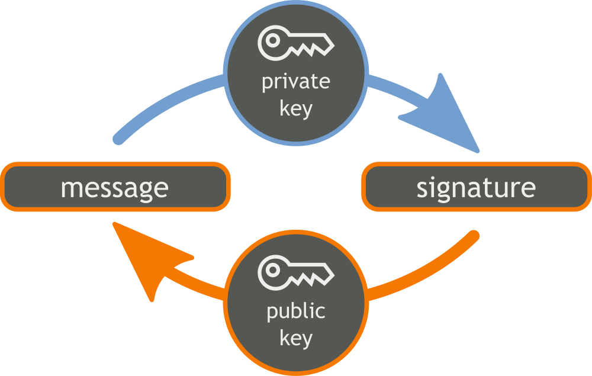
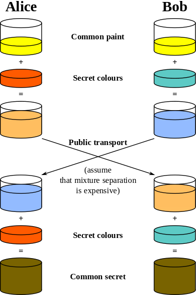

.. include:: <s5defs.txt>

===========
Crypto 1010 
===========

:Author: Aaron Toponce
:Email: aaron.toponce@gmail.com
:Date: May 7, 2015

License
=======

This presentation is licensed under the Creative Commons Attribution-ShareAlike
license.

See http://creativecommons.org/licenses/by-sa/3.0/ for more details.

.. container:: handout
    
    This document is licensed under the CC:BY:SA
    Details to the license can be found here:
    http://creativecommons.org/licenses/by-sa/3.0/

    The licnese states the following:
     * You are free to copy, distribute and tranmit this work.
     * You are free to adapt the work.
    Under the following conditions:
     * You must attribute the work to the copyright holder.
     * If you alter, transform, or build on this work, you may redistribute the
       work under the same, similar or compatible license.
    With the understanding that:
     * Any conditions may be waived if you get written permission from the
       copyright holder.
     * In no way are any of the following rights affected by the license:
     
         * Your fair dealing or fair use rights;
         * The author's moral rights;
         * Rights other persons may have either in the work itself or
           in how the work is used, such as publicity or privacy rights.
           
     * For any reuse or distribution, you must make clear to others the license
       terms of this work. The best way to do this is with a link to the web
       page provided above or below.

    The above is a human-readable summary of the license, and is not to be used
    as a legal substitute for the actual licnse. Please refer to the formal
    legal document provided here:
    http://creativecommons.org/licenses/by-sa/3.0/legalcode

Introduction
============

* Symmetric Encryption
* Asymmetric Encryption
* Encryption & Decryption
* Signatures & Verification
* The Diffie-Hellman Key Exchange
* The SSL Handshake
* SSL 1.0, 2.0, 3.0
* TLS 1.0, 1.1, 1.2
* OpenSSH Concepts
* OpenPGP Concepts

Symmetric Encryption
====================

* Shared key secret
* Rotational ciphers
* Substitution ciphers
* Classical "field/hand" ciphers
* One-time pad
* AES, 3DES, Blowfish

Symmetric Encryption Visually
=============================

Block Cipher Modes
==================

* Electronic Code Block (ECB)
* Cipher Block Chaining (CBC)
* Cipher Feedback (CFB)
* Output Feedback (OFB)
* Counter (CTR)
* Counter with CBC (CCM)
* Carter-Wegman + CTR mode (CWC)
* Offset Codebook Mode (OCM)
* Galois/Counter Mode (GCM)
* EAX (Embrace And eXtend?)

ECB Visually
============

.. image:: images/ecb-1.png

CBC Visually
============

.. image:: images/cbc-1.png
.. image:: images/cbc-2.png

CFB Visually
============

.. image:: images/cfb-2.png

OFB Visually
============

.. image:: images/ofb-1.png
.. image:: images/ofb-2.png

CTR Visually
============

.. image:: images/ctr-2.png

Problms with ECB Mode
=====================

* ``$ openssl enc -aes-128-ecb -in openwest.bmp -out openwest-ecb.bmp``
* ``$ openssl enc -aes-128-cbc -in openwest.bmp -out openwest-cbc.bmp``
* ``$ dd bs=1 count=54 conv=notrunc if=openwst.bmp of=openwst-ecb.bmp``
* ``$ dd bs=1 count=54 conv=notrunc if=openwst.bmp of=openwst-cbc.bmp``
* ``$ convert openwest.bmp openwest.png``
* ``$ convert openwest-ecb.bmp openwest-ecb.png``
* ``$ convert openwest-cbc.bmp openwest-cbc.png``

Problems with ECB Mode Visually
===============================

+-------------------------------------+-----------------------------------------+-----------------------------------------+
| .. image:: images/openwest-logo.png | .. image:: images/openwest-logo-ecb.png | .. image:: images/openwest-logo-cbc.png |
+-------------------------------------+-----------------------------------------+-----------------------------------------+
| The original OpenWest logo          | Encrypted using ECB mode                | Modes other than ECB result in          |
|                                     |                                         | pseudo-randomness                       |
+-------------------------------------+-----------------------------------------+-----------------------------------------+

Asymmetric Encryption
=====================

* Private and public keys.
* Public keys distributed.
* RSA, ECC, Diffie-Hellman.

Encryption & Decryption
=======================

* Encryption: plaintext -> ciphertext.
* Decryption: ciphertext -> plaintext.
* Encryption requires public key.
* Decrytpion requires private key.

Asymmetric Encryption Visually
==============================

Signatures & Verification
=========================

* Nonrepudiates data.
* Like a physical signature, but stronger.
* Signing requires the private key.
* Verification requires the public key.

Signatures & Verification Visually
==================================

The Diffie-Hellman Key Exchange
===============================

* Symmetric key exchange.
* Vulnerable to MITM attack.
* Both parties A & B generate a secret.
* A encrypts a message with his secret.
* A sends ciphertext to B.
* B encrypts the ciphertext with his secret.
* B sends ciphertext to A.
* A decrypts ciphertext.
* A sends to B.
* B decrypts ciphertext- has A message.

Diffie-Hellman KEX Visually
===========================

The SSL Handshake
=================

* Client issues "HELLO".
* Server sends public certificate.
* Client authenticates certificate.
* Client generates secret.
* Client encrypts secret with cert.
* Client sends ciphertext to server.
* Server decrypts ciphertext.
* Secret used at symmetric key.

SSL 1.0
=======

* Developed by Netscape in 1993.
* Never actually released.
* No data integrity. Later added CRC.
* RC4 for encryption.
* Vulnerable to replay attacks.
* No RFC documents.
* Broken in 10 minutes during a presentation by Vint Cerf.

SSL 2.0
=======

* Developed by Netscape in 1994.
* First public release.
* RSA and MD5-only.
* 40-bit "export" and 128-bit RC2.
* 40-bit "export" and 128-bit RC4 .
* 64-bit DES.
* 128-bit IDEA.
* 192-bit 3DES.
* CBC mode only.

SSL 2.0 Weaknesses
==================

* Vulnerable to MITM attacks.
* Vulnerable to a cipher suite attack.
* Vulnerable to a truncaction attack.
* Uses weak MAC construction.
* Client handshake cannot be interrupted.
* No certificate chaining.

SSL 3.0
=======

* Released in 1996 due to flaws in 2.0.
* Complete redesign.
* Defined in RFC 6101.
* MD5 asd SHA-1.
* DES, 3DES, and RC4.
* 40-bit export.
* Backward compatible with 2.0.
* Supports cert chaining.
* RSA, Diffie-Hellman, and Fortezza key exchanges.
* Allows for compression & decompression.
* Different cipher specifications.
* CBC mode only.

SSL 3.0 Weaknesses
==================

* RC4 biases.
* CBC not authenticated (padding oracle attacks abound).
* BEAST attack (CBC padding non-deterministic).
* Lucky 13 attack (CBC timing attack).
* POODLE attack (MITM attack forcing SSL 3.0 downgrade).

TLS 1.0
=======

* Released in 1999 as an upgrade to SSL 3.0.
* TLS 1.0 is NOT SSL 3.0.
* Defined in RFC 2246.
* Same cipher suite as SSL 3.0.
* Added ephemeral Diffie-Hellman (authenticated with DSA or RSA).
* Authenticated CBC.

TLS 1.0 Weaknesses
==================

* Hashing algorithms MD5 and SHA-1.
* No known pseudorandom function weaknesses.
* Ciphers RC2, RC4, and DES.
* Supports 40-bit "export" mode.
* Support anonymous ciphers (MITM attack).

TLS 1.1
=======

* Released in April 2006.
* Defined in RFC 4346.
* Dropped RC2 support.
* MD5, SHA-1, and SHA-256.
* AES, DES, 3DES, and RC4.
* DHE with DSA or RSA.
* Authenticated CBC.
* Explicit Initialization Vector (vs. implicit IV).
* Change in handling of padding errors.
* Support for IANA registration of parameters.

TLS 1.1 Weaknesses
==================

* No real flaw found in TLS 1.1.
* MD5 and SHA-1 support.
* DES and RC4 support.
* No known pseudorandom function weaknesses.
* No authenticated encryption modes (improved performance).

TLS 1.2
=======

* Released in August 2008
* Defined in RFC 5246.
* Dropped RC4, IDEA and DES cipher support.
* Dropped 40-bit "export" mode.
* PRF MD5-SHA1 combination replaced by SHA-256.
* MD5 support only on RSA certificate signatures.
* Mandated support for AES.
* Agreement on hash and ciphers between server and client.
* Authenticated encryption with associated data (AEAD) GCM and CCM added.
* Never negotiate SSL 2.0

TLS 1.3 (draft)
===============

* All further TLS version refined in RFC 6176.
* Dropped compression support (CRIME, BREACH, etc).
* Dropped renegotiation support (new params, new keys, etc).
* Dropped non-AEAD ciphers (no CBC).
* Dropped RSA and anonymous DH KEX.
* Dropped backwards compatibility support for SSL or RC4.

OpenSSH History
===============

* Created by the OpenBSD as an alternative to SSH by Tatu Ylönen.
* Forked from OSSH, which itself was a fork of Ylönen's original SSH 1.2.12 release.
* First appeared in OpenBSD 2.6.
* First portable release in October 1999.
* Developers threatened by Tatu Ylönen for trademark violation in 2001.
* Defined in RFCs 4250-4256, 4335, 4344, 4345, 4419, 4432, 4462, 4716, 4819, 5647, 5656, 6187, 6239, 6594, & 6668.

OpenSSH Concepts
================

* OpenSSH 6.8 released March 18, 2015.
* 3DES, AES, Blowfish, CAST128, "arcfour", ChaCha20 Ciphers.
* SHA-1, SHA-256, SHA-512, MD5, RIPEMD160 MACS.
* DH, DH group, ECDH NIST "p-curves", Curve25519 KEX.
* CBC and arcfour disabled by default.
* Supports building against LibreSSL.
* Supports Kerberos tickets.
* Supports password and key-based authentication.
* Provides SSH, secure FTP, and secure copy.
* Supports tunneling.
* Supports X11 forwarding.

Conclusion
==========

* Questions?
* Comments?
* Rude Remarks?
