.. include:: <s5defs.txt>

===================
End-to-End Security
===================

:Author: Aaron Toponce
:Email: aaron.toponce@gmail.com
:Date: May 8, 2015

License
=======

This presentation is licensed under the Creative Commons Attribution-ShareAlike
license.

See http://creativecommons.org/licenses/by-sa/3.0/ for more details.

.. container:: handout
    
    This document is licensed under the CC:BY:SA
    Details to the license can be found here:
    http://creativecommons.org/licenses/by-sa/3.0/

    The licnese states the following:
     * You are free to copy, distribute and tranmit this work.
     * You are free to adapt the work.
    Under the following conditions:
     * You must attribute the work to the copyright holder.
     * If you alter, transform, or build on this work, you may redistribute the
       work under the same, similar or compatible license.
    With the understanding that:
     * Any conditions may be waived if you get written permission from the
       copyright holder.
     * In no way are any of the following rights affected by the license:
     
         * Your fair dealing or fair use rights;
         * The author's moral rights;
         * Rights other persons may have either in the work itself or
           in how the work is used, such as publicity or privacy rights.
           
     * For any reuse or distribution, you must make clear to others the license
       terms of this work. The best way to do this is with a link to the web
       page provided above or below.

    The above is a human-readable summary of the license, and is not to be used
    as a legal substitute for the actual licnse. Please refer to the formal
    legal document provided here:
    http://creativecommons.org/licenses/by-sa/3.0/legalcode

Introduction
============

* Information Security
* CIA Triad
* Authenticated Encryption
* The Cryptographic Doom Principle
* Off-the-Record Messaging
* OpenPGP
* Tox
* Bitmessage
* RetroShare

Information Security
====================

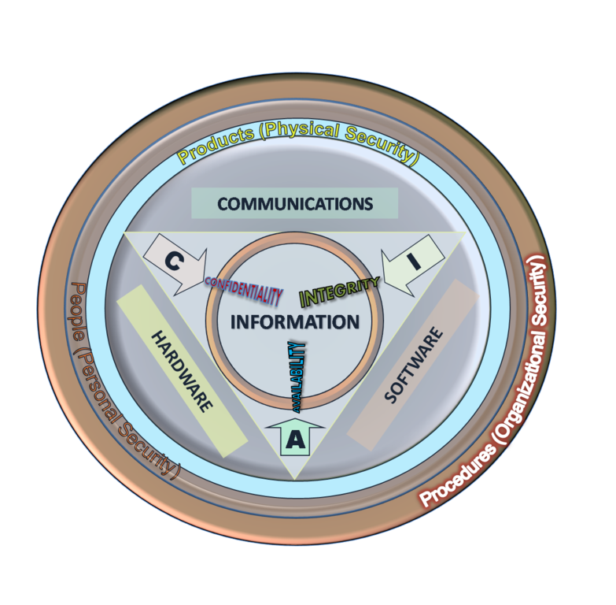

The CIA Triad
=============

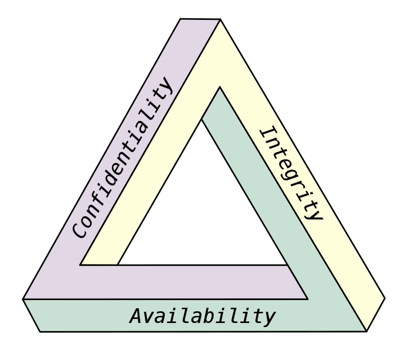

Some Definitions
================

Confidentiality
    Limits access or places restrictions on information.

Integrity
    Maintaining and assuring the accuracy and consistency of data over its
    entire life-cycle.

Availability
    The information must be available at all times when needed.

More Definitions
================

Encryption
    Encoding information such that only authorized parties can read it.
    *Provides only confidentiality*.

Authentication  
    Keeping information tamper-resistant while also proving it originated
    from the sender. *Provides only integrity*.

Confidentiality Without Integrity
=================================

* Vulnerable to a Man-In-The-Middle attack.
* Can send garbage/noise to recipient.
* CBC bit flipping attacks (a 1-bit error in a ciphertext block):

    * Bypass filters by adding malicious characters.
    * Elevate privileges in session cookies.
    * Other miscreant activities.

Cipher Block Chaining (CBC)
===========================

CBC Bit Flipping Explained
==========================

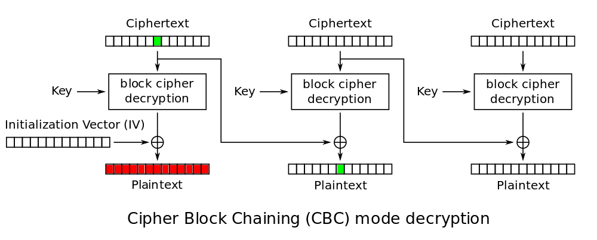

Confidentiality & Integrity w/o Authentication
==============================================

* Vulnerable to chosen prefix attacks.
* Vulnerable to length extension attacks.
* Vulnerable to replay attacks.
* Vulnerable to recation/oracle attacks.

Confidentiality & Authentication
================================

* Plaintext encrypted and digitally signed.
* Hash function requires a private unique key.
* MAC-then-Encrypt
* MAC-and-Encrypt
* Encrypt-then-Mac

Message Authentication Codes (MAC)
===================================

* An agreed-upon key (K) is determined.
* An artibrary-length message (M) is hashed with K.
* The resulting fixed-length digest is known as a "tag" (T).
* CBC-MAC: CBC block cipher MAC.
* HMAC: Hash-based MAC.
* OMAC: One-key cipher-based MAC. Similar to PMAC.
* PMAC: Parallelizable cipher-based MAC. Similar to OMAC.
* UMAC: Universal hash-based MAC (hash function agreed upon).
* VMAC: VHASH block cipher-based MAC.
* Poly1305-AES: AES-based MAC written by Daniel J. Bernstein (djb).

MAC-then-Encrypt
================

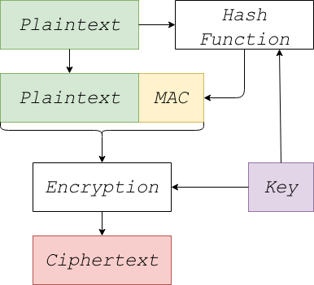

* Plaintext hashed.
* MAC appended to plaintext.
* Plaintext and MAC encrypted.
* No ciphertext integrity.
* Plaintext integrity.
* Used in OpenSSL.

Encrypt-and-MAC
===============

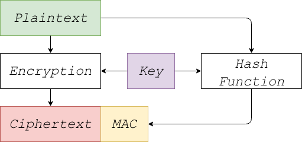

* Plaintext encrypted.
* Plaintext hashed.
* MAC appended to ciphertext.
* No ciphertext integrity.
* Plaintext integrity.
* Used in OpenSSH.

Encrypt-then-MAC
================

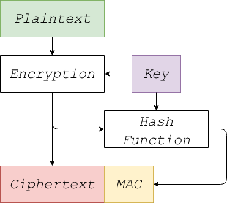

* Plaintext encrypted.
* Ciphertext hashed.
* MAC appended to ciphertext.
* Ciphertext integrity.
* Plaintext integrity.
* Defined in ISO/IEC 19772:2009
* Used in IPSec.

The Cryptographic Doom Principle
================================

* Doom! when verifying the message is *not the first execution*.
* MAC-then-Encrypt vulnerable to the padding oracle attack.
* Lucky Thirteen and POODLE in OpenSSL.
* MAC-and-Encrypt plaintext recovery attack in OpenSSH up to 5.1.
* Mac-and-Encrypt can reveal when messages repeat, if the MAC doesn't
  include a sequence number.

Suggestion
==========

.. image:: images/verify-mac.png
   :align: right

* Encrypt-then-MAC
* Use AES-GCM
* Or ChaCha20-Poly1305
* Or AES-HMAC-SHA-{256,512}
* Or AES-SHA3 (not finalized by NIST, yet)

Off-the-Record Messaging
========================

* AES-128 encrypted (confidentiality)
* SHA-1 hashed (integrity)
* Provides forward secrecy (temporary per-message AES keys).
* Provides deniable authentication (messages not digital signed).
* Authentication through the Socialist Millionaire Protocol.
* Does not support group chats.
* Does not support audio or video.

OTR Support
===========

* Windows, OS X, GNU/Linux, BSD, Android, iOS
* Native:
* Adium, Bitlbee, ChatSecure, Cryptocat, Kopete, Mcabber, TextSecure,
  Xabber, ...
* Via plug-in:
* Gajim, Irssi, Pidgin, Psi, WeeChat, xchat, ...

OTR - Cryptocat
===============

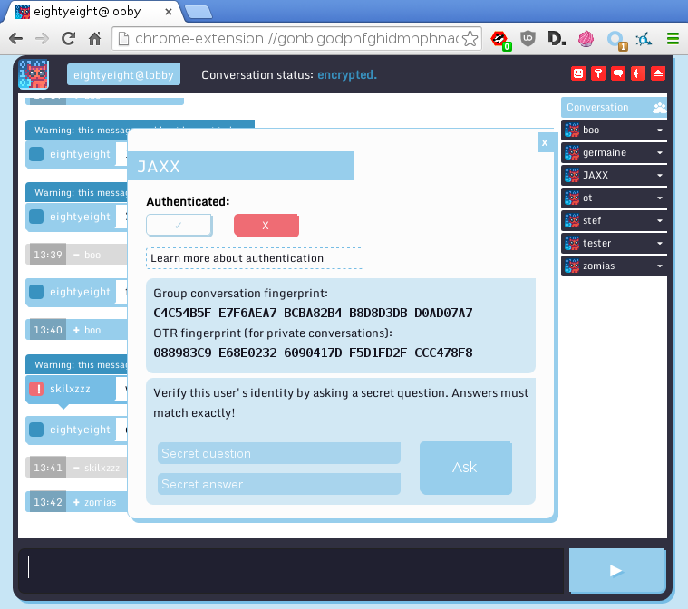

* Free Software client and server software.
* Browser-based client.
* Written in JavaScript.
* Previous versions have had security problems.
* Source code independently audited.

OTR - WeeChat
=============

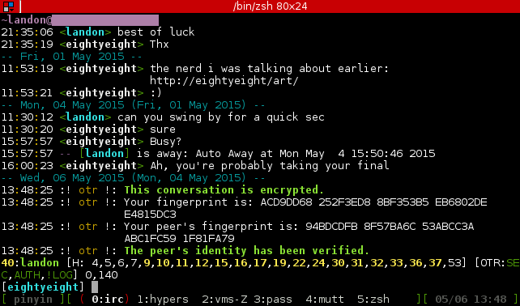

* Free Software plugin for WeeChat (not native).
* Written in Python.
* Supports SMP.
* Policy configuration support.
* Enable/disable logging.
* Supports only OTR protocol version 2.

OpenPGP
=======

* Unencumbered PGP
* RFC 1991- PGP Message EXchange Formats
* RFC 2440- OpenPGP Message Format (obsolete)
* RFC 4880- OpenPGP Message Format (current)
* RFC 5581- The Camellia Cipher in OpenPGP
* RFC 2015- MIME Security with Pretty Good Privacy (PGP)
* RFC 2156- MIME Security with OpenPGP
* RFC 6637- Elliptic Curve Cryptography (ECC) in OpenPGP
* draft-koch-eddsa-for-openpgp-01- EdDSA for OpenPGP

GNU Privacy Guard (GPG)
=======================

* Command-line based.
* Maaintained in 3 branches: "Stable" (2.0), "Modern" (2.1), and "Classic" (1.4).
* Hybrid encryption software (public-key for KEX, and symmetric for speed).
* Stable and Classic support:
* Pubkey: RSA, ElGamal, DSA.
* Ciphers: IDEA, 3DES, CAST5, Blowfish, AES (128, 192, & 256-bit), Twofish,
  Camellia (128, 192, & 256-bit).
* Hash: MD5, SHA-1, RIPEMD-160, SHA-224, SHA-256, SHA-384, & SHA-512.
* Compression: Uncompressed, ZIP, ZLIB, & BZIP2.

GPG Support
===========

* Windows, OS X, GNU/Linux, BSD, Android, iOS
* Applications, frontends, and browser extensions include:
* APG, Claws mail, Enigform, Enigmail, Gajim, Gpg4win, GPGMail,
  GPGServices, GPGTools, KGPG, MCabber, Mutt, PSi, WinPT

Tox
===

* Windows, OS X, GNU/Linux, BSD, Android
* Text single/group and video chat client.
* Architecture separated into a core library, the protocol, and the clients.
* Uses NaCl for the crypto library.
* Curve25519 KEX, XSalso20 cipher (256-bit), Poly1305 MAC.
* Uses the Bittorrent DHT protocol for network traversal.
* No independent security audit.

Tox Screenshot
==============

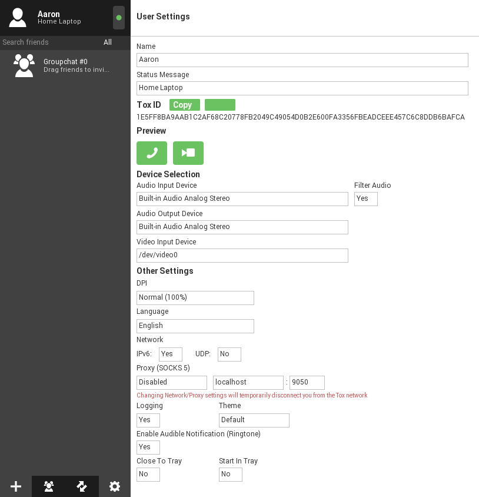

Bitmessage
==========

* Windows, OS X, GNU/Linux, BSD, Android
* Decentralized, peer-to-peer, public-key encrypted, serverless "email".
* Main client written in Python
* Every client attempts decrypting every broadcast message.
* Requires a proof-of-work to send a message to the network.
* All messages broadcast to the network.
* Bitmessage addresses resemble Bitcoin addresses, and aro compatible with
  Bitcoin keys.
* Messages are not archived in the network; removed on nodes after 2 days.
* Encrypted with 256-bit ECC.
* Acknowledgement system for the sender.
* No independent security audit.

Bitmessage Screenshot
=====================

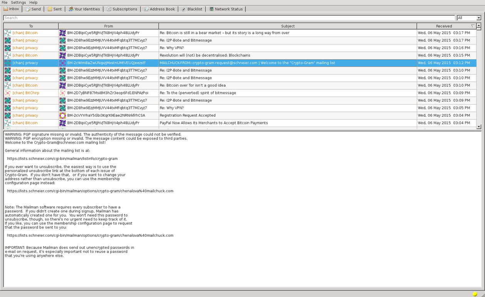

RetroShare
==========

* Decentralized, encrypted, peer-to-peer
* Supports filesharing, serverless email, IM, chatrooms, and BBS.
* Data at rest uses OpeNPGP.
* Network communication uses OpenSSL.
* Posts your IP/Port information via Bittorrent's DHT.
* 2048-bit RSA and 256-bit AES encryption
* All files hashed with SHA-1
* No independent security audit.

RestroShare Screenshot
======================

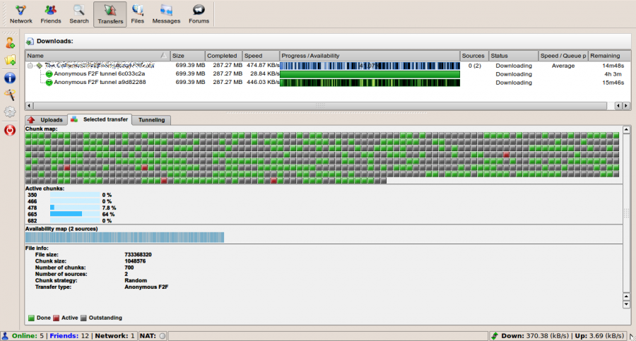

Conclusion
==========

* Questions?
* Comments?
* Rude Remarks?
