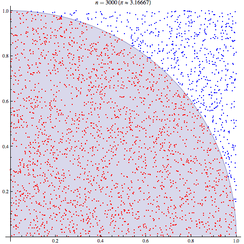

.. include:: <s5defs.txt>

==============
Random Numbers
==============

:Author: Aaron Toponce
:Email: aaron.toponce@gmail.com
:Date: Oct 28, 2015

License
=======

This presentation is licensed under the Creative Commons Attribution-ShareAlike
license.

See http://creativecommons.org/licenses/by-sa/4.0/ for more details.

.. container:: handout
    
    This document is licensed under the CC:BY:SA
    Details to the license can be found here:
    http://creativecommons.org/licenses/by-sa/3.0/

    The licnese states the following:
     * You are free to copy, distribute and tranmit this work.
     * You are free to adapt the work.
    Under the following conditions:
     * You must attribute the work to the copyright holder.
     * If you alter, transform, or build on this work, you may redistribute the
       work under the same, similar or compatible license.
    With the understanding that:
     * Any conditions may be waived if you get written permission from the
       copyright holder.
     * In no way are any of the following rights affected by the license:
     
         * Your fair dealing or fair use rights;
         * The author's moral rights;
         * Rights other persons may have either in the work itself or
           in how the work is used, such as publicity or privacy rights.
           
     * For any reuse or distribution, you must make clear to others the license
       terms of this work. The best way to do this is with a link to the web
       page provided above or below.

    The above is a human-readable summary of the license, and is not to be used
    as a legal substitute for the actual licnse. Please refer to the formal
    legal document provided here:
    http://creativecommons.org/licenses/by-sa/3.0/legalcode

Introduction
============

* Why use random numbers?
* Pseudorandom numbers
* Cryptographically secure pseudorandom numbers
* True random numbers
* Randomness tests

Why need random numbers?
========================

* Lottery drawing
* Generic gambling
* Thermodynamics
* Quantum mechanics
* Pattern recognition
* Game theory
* Monte Carlo simulations
* Cryptography

Randomness
==========

* Lack of pattern or pedictability of events without order.
* Individual events unpredictable.
* Frequency of different outcomes over large events is predictable.
* Randomness is distinct from chaos theory.

Monte Carlo Simulations
=======================

* Approximate a result using random numbers.
* Estimating an approximation for Pi.

Properties of Pseudorandom Numbers (PRNG)
=========================================

* Must start with an initial seed.
* Uniformally distributed.
* Large period.
* Fast generation.

How To Create A PRNG?
=====================

* Middle-square method.
* Linear congruential generator.
* Lagged Fibonacci generator.

Middle-square Method (MSM)
==========================

* Begin with an n-digit seed.
* Square it to obtain a 2n-digit number, adding leading zeros as necessary.
* Take the middle n-digits as the next seed.
* Repeat.

MSM Example
===========

* 4739
* (4739)^2 = 22458121
* 22458121 -> 4581
* (4581)^2 = 20985561
* 20985561 -> 9855
* (9855)^2 =  97121025
* 97121025 -> 1210
* etc.
* Generated sequence: 458198551210...

MSM Observations
================

* Small period less than the n-digit modulus (2-digit == mod 100)
* Commonly converges to zero.
* Less commonly cycles on a number other than zero.
* Other seed values form very short repeating cycles.

Linear Congruential Generator (LCG)
===================================

* Start with seed X_0, "a", "b", & a modulus "m".
* X_n+1 = (a*X_n + b) mod m
* Let X_n = X_n+1

LCG Example
===========

* Let X_0 = 7, a = 1, b = 7, & m = 10.
* X_1 = (1*7 + 7) mod 10 = 4
* X_2 = (1*4 + 7) mod 10 = 1
* X_3 = (1*1 + 7) mod 10 = 8
* X_4 = (1*8 + 7) mod 10 = 5
* X_5 = (1*5 + 7) mod 10 = 2
* X_6 = (1*2 + 7) mod 10 = 9
* X_7 = (1*9 + 7) mod 10 = 6
* etc.
* Generated sequence: 4185296...

LCG Observations
================

* Period is at most "m", and for some choices of "a", much less.
* Fast & require minimal memory to retain state.
* The points will lie on at most (n!m)^(1/m) hyperplanes in n-dimensional space.
* The LCG will have a full period for all seeds iff:
* "m" and the offset "b" are relatively prime.
* "a - 1" is divisible by all prime factors of "m".
* "a - 1" is divisible by 4 if "m" is divisible by 4

Lagged Fibonacci Generator (LFG)
================================

* Begin with 2 taps "j" & "k" and a modulus "m".
* Begin with a seed of at least "k" digits.
* Need at one odd and one even tap.
* S_n = S_n-j + S_n-k mod m, 0 < j < k.
* Can have more than 2 taps, although uncommon.

LFG Example
===========

* Let seed = 8675309
* Let j = 3, k = 7, m = 10
* S_1 = 7 + 9 mod 10 = 6
* S_2 = 5 + 6 mod 10 = 1
* S_3 = 3 + 1 mod 10 = 4
* S_4 = 0 + 4 mod 10 = 4
* S_5 = 9 + 4 mod 10 = 3

LFG Visually
============

.. code::
    
    S_1 =  8 6 [7] 5 3 0 [9] => 7+9 mod 10 = 6
    S_2 =  6 7 [5] 3 0 9 [6] => 5+6 mod 10 = 1
    S_3 =  7 5 [3] 0 9 6 [1] => 3+1 mod 10 = 4
    S_4 =  5 3 [0] 9 6 1 [4] => 0+4 mod 10 = 4
    S_5 =  3 0 [9] 6 1 4 [4] => 9+4 mod 10 = 3
    S_6 =  0 9 [6] 1 4 4 [3] => 6+3 mod 10 = 9
    S_7 =  9 6 [1] 4 4 3 [9] => 1+9 mod 10 = 0
    S_8 =  6 1 [4] 4 3 9 [0] => 4+0 mod 10 = 4
    S_9 =  1 4 [4] 3 9 0 [4] => 4+4 mod 10 = 8
    
    Generated: 614439048...

LFG Observations
================

* Maximum period of (2^k - 1)*2^(m-1).
* y = x^k + x^j + 1 must be primitive over integers mod 2.
* Initialization of LFGs is very complex.
* Can fail the Birthday Spacings test.
* Subtraction, multiplication, & XOR can be used.

Other PRNGs
===========

* Mersenne Twister (most widely used)
* Linear feedback shift register
* Multiply-with-carry

Properties of a CSPRNG
======================

* Must start with an initial seed.
* Uniformally distributed.
* Large period.
* Fast generation.
* Must satisfy the next-bit test.
* Must withstand "state compromise extensions".

How To Create A CSPRNG?
=======================

* Must be non-linear.
* Can be built using existing cryptographic primitives.
* Can address the discrete logarithm problem.
* Can address the quadratic residuosity problem.

Blum Blum Shub
==============

* Requires only a seed X_0 and modulus "M".
* "M" must be the product of two primes "p" & "q"
* The primes must be congruent to 3 mod 4.
* The GCD(tot(p-1),tot(q-1)) should be small.
* X_0 must be co-prime to "M" ("p" & "q" are not factors of X_0)
* X_n+1 = (X_n)^2 mod M
* X_n = X_n+1

Blum Blum Shub Example
======================

* Let p=11, q=19, X_0 = 3
* X_1 = (3)^2 mod 209 = 9
* X_2 = (9)^2 mod 209 = 81
* X_3 = (81)^2 mod 209 = 82
* X_4 = (82)^2 mod 209 = 36
* X_5 = (36)^2 mod 209 = 42
* X_6 = (42)^2 mod 209 = 92
* etc.
* Generated sequence: 398182364292...

Blum Blum Shub Observations
===========================

* Highly inefficient.
* M should be at least 80-bits in size.
* Security proof if the primes are chosen carefully.

Cryptographic Primitive In Counter Mode
=======================================

* Block cipher, stream cipher, or hash function.
* Begin with an n-bit counter "i" and a key "k".
* Key should have at least 80-bits of entropy.
* N = CP(i, k)
* i += 1

Counter Mode CSPRNG Example
===========================

* AES-128 in ECB mode (no IV).
* i=(128-bits 0), k="n5kzb2npmqaadheh"
* AES-128(i, k) = 7nYXRPVfbJ9bKKXY5/Xrgw
* AES-128(i+1, k) = mMuT/o4uqyi/ZiSoTuaXLA
* AES-128(i+2, k) = YCrIIhPLQmBEIpxFUXEqDA
* AES-128(i+3, k) = wBnyyhtX4oG5ar6Jxpu0+A
* AES-128(i+4, k) = PEVHWFBR0psbAxNuNiRzcA
* etc.

Counter Mode CSPRNG Observations
================================

* Only as secure as the primitive used.
* The private key must have sufficient entropy.
* Encoding may be needed.

ANSI x9.17 CSPRNG
=================

* Initially defined with 64-bit 3DES.
* Block cipher, stream cipher, or hash function.
* Begin with an n-bit seed "s" and an n-bit key "k".
* while true:
* Get an n-bit precision time "t".
* X = CP(t, k)
* O = CP(XOR(s, X), k)
* s = CP(XOR(O, X), k)

ANSI x9.17 CSPRNG Example
=========================

.. code::

    for i in xrange(0, number):
        date = repr(time.time())
        temp = aes.encrypt(date.zfill(32))
        out = aes.encrypt(sxor(seed,temp))
        seed = aes.encrypt(sxor(out,temp))
        res = struct.unpack('QQ', out)
        print(res[0]*2**64+res[1])

ANSI x9.17 CSPRNG Example
=========================

.. code::

    $ python ansi_x9.17.py -n 5 -k tawb6tfp -s 3p4cmuh2
    314010904079469780053519644035505825480
    306641776578407103837728977951414077374
    156955769336596636999723525334223823715
    173148246584751831703187613687035398429
    115865582697038227031809203876290428300

ANSI x9.17 CSPRNG Observations
==============================

* Because defined with 3DES, superceded by ANSI x9.31
* Only as secure as the primitive used.
* The private key must have sufficient entropy.
* Adversary could set the clock

Other CSPRNGs
=============

* Blum Micali
* ISAAC
* Inversive congruential generator
* Rule 30
* http://ae7.st/p/h0skd

Properties Of A TRNG
====================

* Must be unbiased (may need whitening).
* Hardware must be verifiable.
* Firmware must be verifiable.
* Physical phenomena must be verifiable.
* Fast generation.

Quantum TRNG
============

* Nuclear decay
* Photons traveling through a semi-transparent mirror.
* Shot noise (mechanical noise in electronic circuits).
* Amplification of reverse-biased transistors.

Non-quantum TRNG
================

* Resistor thermal noise.
* Diode avalanche noise.
* Atmospheric noise (lightning strikes, man-made, cosmic, etc.).
* Clock drift.
* Human input timings.

TRNG Problems
=============

* Almost always biased by default.
* Statistical tests should be performed constantly.
* Must be constantly monitored for proper operation.
* Entropy must be correctly and conservatively estimated.
* Most "break" silently, producing decreasingly random numbers.
* May be influenced by outside interferrence.

John von Neumann debiasing
==========================

* "00" & "11" discarded.
* "10" = 1
* "01" = 0
* Guarantees unbiased output.
* Does not guarantee random output.
* Lose at least 1/2 the bits, possibly more.

CSPRNG With Refreshed Key
=========================

* Use a cryptographic primitive (AES, SHA-256, ChaCha20, etc.).
* TRNG output becomes key for CSPRNG output.
* Limited to the security of the primitive.

Some USB TRNG Devices
=====================

.. class:: text
   :tiny:

+-------------------------+----------------+-------+------------+-------------+----------+----------+
| Manufacturer            | Model          | Price | Throughput | Value       | Hardware | Software |
+=========================+================+=======+============+=============+==========+==========+
| Intel                   | Core i7 4820   | $323  | 3 Gbps     | 10 Mbps/$   | Closed   | Mixed    |
+-------------------------+----------------+-------+------------+-------------+----------+----------+
| Realtex                 | SDR dongles    | $24   | 2.8 Mbps   | 119 Kbps/$  | Closed   | Open     |
+-------------------------+----------------+-------+------------+-------------+----------+----------+
| Kidekin                 | TRNG           | $79   | 2 Mbps     | 25.3 Kbps/$ | Closed   | Closed   |
+-------------------------+----------------+-------+------------+-------------+----------+----------+
| Flying Stone Technology | FST-01         | $35   | 602 Kbps   | 17.2 Kbps/$ | Open     | Open     |
+-------------------------+----------------+-------+------------+-------------+----------+----------+
| BitBabbler              | Black          | $40   | 650 Kbps   | 16.3 Kbps/$ | Unknown  | Open     |
+-------------------------+----------------+-------+------------+-------------+----------+----------+
| BitBabbler              | White          | $160  | 2.5 Mbps   | 15.6 Kbps/$ | Unknown  | Open     |
+-------------------------+----------------+-------+------------+-------------+----------+----------+
| Wayward Geek            | Infinite Noise | $35   | 300 Kbps   | 8.6 Kbps/$  | Open     | Open     |
+-------------------------+----------------+-------+------------+-------------+----------+----------+
| Moonbase Otago          | OneRNG         | $50   | 360 Kbps   | 7 Kbps/$    | Open     | Open     |
+-------------------------+----------------+-------+------------+-------------+----------+----------+
| SimTec Electronics      | Entropy Key    | £36   | 26.6 Kbps  | 739 bps/£   | Closed   | Open     |
+-------------------------+----------------+-------+------------+-------------+----------+----------+

Randomness Tests
================

* Analyze distribution patterns of a data set.
* Used to judge the quality of the generator
* Based on statistical tests
* Diehard Tests
* FIPS 140-2 Tests
* Entropy Estimation

Diehard Tests
=============

* Birthday spacings
* Overlapping permutations
* Ranks of matrices
* Monkey tests
* Count the ones
* Parking lot test
* Minimum distance test
* Squeeze tests
* Overlapping sums
* Runs test
* Craps test

Diehard Example
===============

* Testing the birthday spacing test::

    $ dieharder -d 0 < /tmp/entropy.bin

* Testing the parking lot test::

    $ dieharder -d 10 < /tmp/entropy.bin

* Running all the tests::

    $ dieharder -a < /tmp/entropy.bin

FIPS 140-2 Tests
================

* Monobit frequency test
* Poker test
* Runs test
* Long run test
* Continuous run test

FIPS 140-2 Example
==================

.. class:: text
   :small:
   :mono:
    
    $ rngtest < /tmp/entropy.bin
    
    (...snip...)
    
    rngtest: bits received from input: 3440640
    
    rngtest: FIPS 140-2 successes: 172
    
    rngtest: FIPS 140-2 failures: 0
    
    rngtest: FIPS 140-2(2001-10-10) Monobit: 0
    
    rngtest: FIPS 140-2(2001-10-10) Poker: 0
    
    rngtest: FIPS 140-2(2001-10-10) Runs: 0
    
    rngtest: FIPS 140-2(2001-10-10) Long run: 0
    
    rngtest: FIPS 140-2(2001-10-10) Continuous run: 0
    
    rngtest: input channel speed: (min=2.661; avg=3.898; max=9.313)Gibits/s
    
    rngtest: FIPS tests speed: (min=34.869; avg=92.881; max=113.533)Mibits/s
    
    rngtest: Program run time: 36726 microseconds

Entropy Estimation
==================

* Optimum compression
* Chi square distribution
* Arithmetic mean
* Monte Carlo for Pi
* Serial correlation coefficient

Entropy Estimation Example
==========================

.. class:: text
   :small:
   :mono:

    $ ent /tmp/entropy.bin
    
    Entropy = 7.999566 bits per byte.
    
    Optimum compression would reduce the size
    
    of this 430080 byte file by 0 percent.
    
.. class:: text
   :small:
   :mono:

    Chi square distribution for 430080 samples is 258.39, and randomly
    would exceed this value 42.90 percent of the times.
    
.. class:: text
   :small:
   :mono:

    Arithmetic mean value of data bytes is 127.4131 (127.5 = random).
    
    Monte Carlo value for Pi is 3.152120536 (error 0.34 percent).
    
    Serial correlation coefficient is 0.000457 (totally uncorrelated = 0.0).

Linux CSPRNG
============

* /dev/random and /dev/urandom are ouput from one CSPRNG
* CSPRNG based on SHA-1
* Use /dev/urandom
* Use /dev/urandom
* Use /dev/urandom
* Use /dev/urandom
* Use /dev/urandom
* http://ae7.st/s/qb4el

Conclusion
==========

* PRNG are simple, fast, but possibly predictable.
* CSPRNG are complex, fast, and unpreductable.
* TRNG are complex, might be fast, and biased.
* Run randomness tests on your generator.
* Use /dev/urandom

Fin
===

Comments, questions, or rude remarks?

:Email: aaron.toponce@gmail.com
