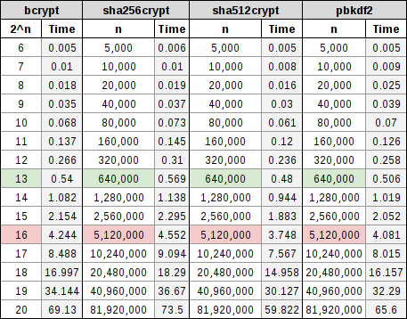
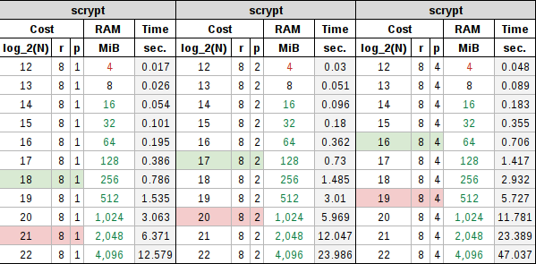
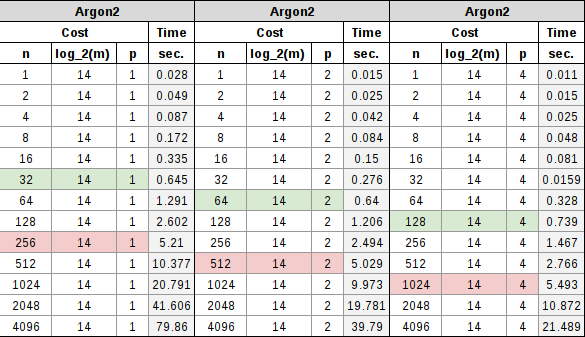

.. include:: <s5defs.txt>

========================
Security Through Obesity
========================

:Author: Aaron Toponce
:Email: aaron.toponce@gmail.com
:Date: Jul 14, 2016

License
=======

This presentation is licensed under the Creative Commons Attribution-ShareAlike
license.

See http://creativecommons.org/licenses/by-sa/4.0/ for more details.

.. container:: handout
    
    This document is licensed under the CC:BY:SA
    Details to the license can be found here:
    http://creativecommons.org/licenses/by-sa/3.0/

    The licnese states the following:
     * You are free to copy, distribute and tranmit this work.
     * You are free to adapt the work.
    Under the following conditions:
     * You must attribute the work to the copyright holder.
     * If you alter, transform, or build on this work, you may redistribute the
       work under the same, similar or compatible license.
    With the understanding that:
     * Any conditions may be waived if you get written permission from the
       copyright holder.
     * In no way are any of the following rights affected by the license:
     
         * Your fair dealing or fair use rights;
         * The author's moral rights;
         * Rights other persons may have either in the work itself or
           in how the work is used, such as publicity or privacy rights.
           
     * For any reuse or distribution, you must make clear to others the license
       terms of this work. The best way to do this is with a link to the web
       page provided above or below.

    The above is a human-readable summary of the license, and is not to be used
    as a legal substitute for the actual licnse. Please refer to the formal
    legal document provided here:
    http://creativecommons.org/licenses/by-sa/3.0/legalcode

Introduction
============

* Not passwords managers (KeePass, LastPass, etc.)
* Password hashing algorithms
* History of storing passwords to disk
* The threat model and adversary
* Plaintext, crypt(3), NTLM, LANMAN, MD5, md5crypt, SHA-1
* The threat model and adversary revised
* bcrypt, sha256crypt, sha512crypt, PBKDF2
* scrypt
* Argon2
* PHC candidates

History of Password Storage
===========================

* Multics used the square of the password.
* Switched to the square ANDed with a mask.
* Unix initially stored plaintext (/etc/passwd)
* Unix used crypt(3) based on DES in 1974 in /etc/passwd
* Unix created /etc/shadow to prevent global viewing.
* One-way functions looked promising.
* Salts added to thwart precomputation attacks.

Windows Password Storage
========================

* Windows NT introduced LANMAN and NTLM.
* NTLM and LANMAN not salted.
* Rainbow tables exist due to LM and NTLM.
* Weaker than crypt(3).
* Fast and lightweight.
* Converted to uppercase, then pads to 14-bytes.
* The 14-byte password is split into two 7-byte chunks.
* Two 7-byte passwords are easier to find.
* NTLMv2 is still used in Windows systems.

The Attackers Threat Model
==========================

* Attackers hav always been more powerful than defenders.
* Defense is only as strong as the weakest link.
* Have all the time they need.
* Variable and large resevoirs of resources.
* Current threat is highly threaded GPUs, FPGAs, and ASICs.

The Defense
===========

* Enforce password complexity.
* Rotation policies.
* Restrict attack vector.

Avoid
=====

* None (plaintext, hexadecimal, base64, rot13, etc.).
* Vanilla MD5, SHA-1/2/3.
* crypt(3), md5crypt.
* Any general purpose one-way hashing function.
* Any encryption algorithm.
* Your own design.

Why Not To Use Generic Hashes
=============================

* These algorithms are designed to be fast, fast, fast.
* We don't want speed, because crackers have speed too.
* Without a cost factor, billions of guesses per second practical.

Vanilla Benchmark Example
=========================

* 8x Nvidia GTX 1080 with Hashcat
* MD5: 200 GH/s
* SHA-1: 68 GH/s
* SHA-256: 23 GH/s
* SHA-512: 9 GH/s
* SHA-3: 6 GH/s

Why Not to use md5crypt
=======================

* Cost factor hard coded to 1,000 rounds
* 80 MH/s benchmark

Best Practice
=============

* In order of preference:
* scrypt
* bcrypt
* Argon2
* sha512crypt
* sha256crypt
* PBKDF2

Why Argon2 Is Not 1st
=====================

* 2015 Password Hashing Contest winner.
* Needs at least 5 years of analysis.
* Deploy for testing, but not to production.

What is sha2crypt?
==================

* sha256crypt based on SHA-256
* sha512crypt based on SHA-512
* Developed by Urlich Drepper for GNU libc.
* Modeled after md5crypt.
* Unless provided, autogenerates a salt of 16 characters max.
* Has a customizable linear work factor.
* Default iterations is 5,000.
* Default on almost all GNU/Linux operating systems.

sha2crypt Benchmarks
====================

* sha256crypt (5,000 iterations): 3 MH/s
* sha512crypt (5,000 iterations): 1 MH/s

What is bcrypt?
===============

* Developed by Niels Provos and David Mazières.
* Designed after the expensive key setup in Blowfish.
* Blowfish was developed by Bruce Schneier.
* Unless provided, autogenerates a salt.
* Has a customizable exponential work factor.
* Available for GNU/Linux in libpam-unix2.
* Recommended work factor is at least 10.

bcrypt Benchmarks
=================

* bcrypt (cost: 5): 105 KH/s
* bcrypt (cost 10): 3 KH/s

What is PBKDF2?
===============

* Developed by RSA Laboratories.
* Standardized as PKCS#5 v2.0 and RFC 2898.
* Relies on any PRF (hash, cipher, HMAC).
* Key derivation function with arbitrary length.
* Manual salt must be provided.
* Cost is CPU, RAM, and product.
* Has a customizable linear work factor.
* Recommended iterations in 2000 was 1,000.
* Password hash for OS X with 30k-50k iterations.

PBKDF2 Benchmarks
=================

* 1,000 rounds (default)
* PBKDF2-HMAC-MD5: 59 MHps
* PBKDF2-HMAC-SHA1: 26 MHps
* PBKDF2-HMAC-SHA256: 9 MHps
* PBKDF2-HMAC-SHA512: 3 MHps

Comparison Table
================

What is scrypt?
===============

* Developed by Colin Percival for the Tarsnap backup service.
* Designed to be expensive both on the CPU and in RAM.
* Both the CPU and RAM cost controlled together.
* Unless provided, autogenerates a salt.
* Has a customizable exponential work factor.
* Recommend cost: (N=16384, r=8, p=1) (16 MiB RAM).

scrypt Benchmarks
=================

* scrypt (N=1024, r=1, p=1) (128 KiB RAM): 3 MH/s
* scrypt (N=16384, r=8, p=1) (16 MiB RAM): 24 KH/s

scrypt Table
============

* See https://ae7.st/s/passwords

What is Argon2?
===============

* Winner of the PHC in July 2015.
* Designed by Alex Biryukov, Daniel Dinu, and Dmitry Khovratovich.
* Comes in two versions- Argon2d and Argon2i.
* Argon2d maximized GPU cracking resistance.
* Argon2i resistant to side-channel attacks.
* Cost is: CPU, RAM, parallelism.
* Should balance CPU and RAM together.
* Attacks on Argon2i, fixed in 1.3.

Argon2 Benchmarks
=================

* Argon2 (n=128, m=12, p=4) for interactive login (.5s).
* Argon2 (n=4096, m=12, p=4) for symmetric key derivation (5s).

Argon2 Table
============

* See https://ae7.st/s/passwords

bcrypt Weakness
===============

* C NULL repoints pointer
* ASCII encode
* 72 character max password length
* Pre-hash with SHA-512
* bcrypt(base64(sha-512(password)))

scrypt Weakness
===============

* See https://ae7.st/s/scrypt
* Reduction of strength by weak params.
* 4 MiB RAM or less weaker than bcrypt.
* Recommended 16 MiB or greater.

Argon2i Weakness
================

* Not applicable to Argon2d (passwords).
* Single pass with 1/4 to 1/5 desired RAM.
*   Fixed in 1.3
* Complexity O(n^7/4 log(n)) for all parameters
*   Not effective for 3+ iterations.

Best Practices
==============

* Target:

  * .5s for interactive logins.
  * 5s for symmetric key derivation.

* Algorithm costs:

  * bcrypt: 13 - 16
  * sha2crypt: 640k - 5,120k iterations
  * PBKDF2: 640k - 5,120k iterations
  * scrypt: 16 MiB RAM (N=16384, r=8, p=1)
  * scrypt: 16 MiB RAM (N=131072, r=1, p=1)
  * Argon2: Balance between CPU and RAM cost

Fin
===

* Comments, questions, or rude remarks?
