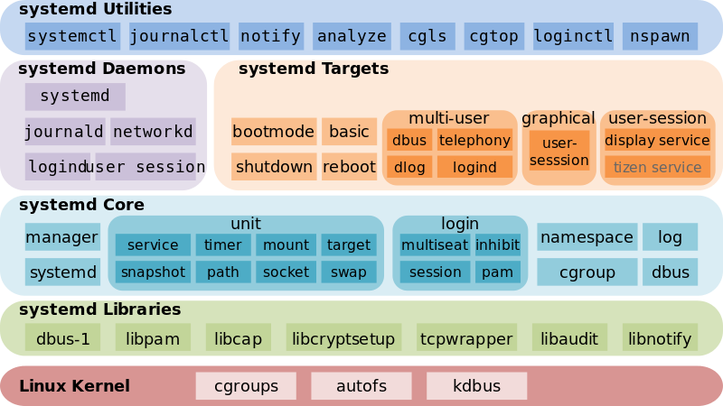
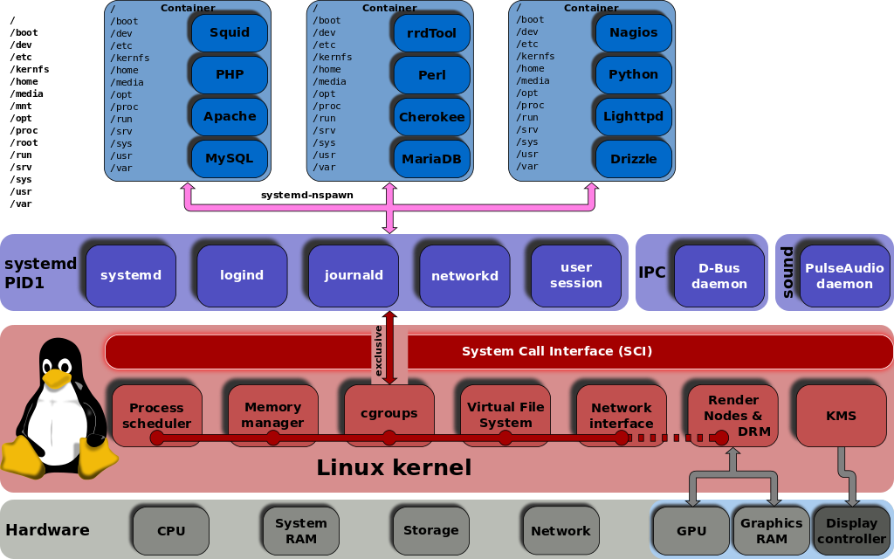
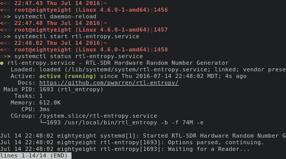

.. include:: <s5defs.txt>

=====================
Understanding systemd
=====================

:Author: Aaron Toponce
:Email: aaron.toponce@gmail.com
:Date: Jul 15, 2016
:URL: http://aarontoponce.org/presents

License
=======

This presentation is licensed under the Creative Commons Attribution-ShareAlike
license.

See http://creativecommons.org/licenses/by-sa/4.0/ for more details.

.. container:: handout
    
    This document is licensed under the CC:BY:SA
    Details to the license can be found here:
    http://creativecommons.org/licenses/by-sa/3.0/

    The licnese states the following:
     * You are free to copy, distribute and tranmit this work.
     * You are free to adapt the work.
    Under the following conditions:
     * You must attribute the work to the copyright holder.
     * If you alter, transform, or build on this work, you may redistribute the
       work under the same, similar or compatible license.
    With the understanding that:
     * Any conditions may be waived if you get written permission from the
       copyright holder.
     * In no way are any of the following rights affected by the license:
     
         * Your fair dealing or fair use rights;
         * The author's moral rights;
         * Rights other persons may have either in the work itself or
           in how the work is used, such as publicity or privacy rights.
           
     * For any reuse or distribution, you must make clear to others the license
       terms of this work. The best way to do this is with a link to the web
       page provided above or below.

    The above is a human-readable summary of the license, and is not to be used
    as a legal substitute for the actual licnse. Please refer to the formal
    legal document provided here:
    http://creativecommons.org/licenses/by-sa/3.0/legalcode

Introduction
============

* What is systmed?
* systemd features

This presentation
=================

* What it's not:

  * Not going to "sell" systemd.
  * Not going to "bash" systemd.

* What it is:

  * An introduction.
  * An explanation of features.
  * A comparison to other init systems.

What is systemd?
================

* PID 1.
* Literally replaces /sbin/init.
* Designed by Lennart Poettering and Kay Sievers in 2010.
* Supervises all processes (it's the parent).
* Manages all services and resources.
* Alternative to SysV Init, Upstart, rc, etc.

systemd adoption
================

* Default in Fedora in 2011.
* Default in Debian, Arch, CentOS, RHEL, CoreOS, openSUSE, SLES, and Ubuntu.
* Not default in Gentoo, Slackware.

systemd myths (page 1)
======================

* http://0pointer.de/blog/projects/the-biggest-myths.html
* monolithic
* about speed
* systmed's fast bootup is irrelevant for servers
* incompatible with shell scripts
* difficult
* not modular
* only for desktops

systemd myths (page 2)
======================

* a result of the NIH syndrome
* not UNIX
* complex
* bloated
* Linux-only (not BSD-friendly)
* kernel-agnostic
* binary configuration files
* feature creep

systemd myths (page 3)
======================

* forces you to do something
* impossible to run syslog
* incompatible with SysV init
* not scriptable
* unstable and buggy
* not debuggable
* Red Hat-only
* doesn't support the /usr split from /
* doesn't allow you to replace components

What does systemd offer?
========================

* Simple dependency control (no SXX + KYY = 100)
* Service activation
* Improved logging, debugging, and profiling
* Faster startup and shutdown
* Tracking and restarting of services
* Improved resource management

systemd architecture
====================

systemd units
=============

* Automount- File system automount point
* Device- Kernel device file
* Mounts- File system mount point
* Paths- systemd path-based activation
* Scope- An externally created process
* Services- Standard system service

systemd units (cont.)
=====================

* Slice- A group of hierarchically organized units
* Snapshots- Saved state of the system manager
* Sockets- IPC, network socket, or a FIFO file
* Swap- Swap device or file for memory paging
* Targets- Group of system units
* Timers- systemd timer-based activation

systemd unit files
==================

* Units are defined with unit files
* Named "name.unit_type"
* The "name" is arbitrary

Unit file dependencies
======================

* Example: zfs-mount.service

.. code::

    Requires=systemd-udev-settle.service
    After=systemd-udev-settle.service
    After=zfs-import-cache.service
    After=zfs-import-scan.service
    Before=local-fs.target

* No more 00-99 ASCII order loading with K and S scripts
* Should be K+S=100, but rarely adhered to

Common Unit file options
========================

* Description=Unit Description
* Documentation=Link to additional docs
* Wants=weaker requirements
* Conflicts=Units cannot coexist
* After=Unit must start after
* Before=Unit must start before
* Requires=Additional units required
* ExecStart=Execute this for starting
* ExecStop=Execute this for stopping

Service Activation
==================

* Start services when needed
* Activated by Socket, Device, Path, Bus, and Timer
* Save resources
* Increased reliabality
* Transparent to the client

Parallel activation
===================

* Faster startup and shutdown
* Five 9's is 5.26 minutes per year
* Capacity on demand (spawning networks)

Improved resource management
============================

* Services labeled and isolated with Cgroups
* More granulated control than with nice/renice
* Balance by shares or with hard limits
* Configure multiple instances of a single service

systemd and cgroups
===================

Kernelspace service management
==============================

* All services tracked by the kernel now
* Kernel knows every child, grandchild, etc.
* Proper reaping of defunct/zombie processes

Autorestarting
==============

* Services DO crash
* systemd can restart the service automatically
* Socket stays open (minimize data loss)

Improved logging
================

* Does not need to rely on syslog (an extra service to start)
* More detail than classic syslog
* Completely optional- can rely on syslog (default)
* Improved debugging and profiling

Targets vs Runlevels
====================

.. table:: systemd targets

    ======== ================== ==============
    Runlevel Target             Symlink Target
    ======== ================== ==============
    0        poweroff.target    runlevel0.target
    1        rescue.target      runlevel1.target
    2        multi-user.target  runlevel2.target
    3        multi-user.target  runlevel3.target
    4        multi-user.target  runlevel4.target
    5        graphical.target   runlevel5.target
    6        reboot.target      runlevel6.target
    ======== ================== ==============

Target Administration
=====================

.. code::

    # systemctl get-default
    multi-user.target
    # systemctl set-default graphical.target
    rm '/etc/systemd/system/default.targot
    ln -s '/usr/lib/systemd/system/graphical.target \
    /etc/systemd/system/graphical.target'
    # systemctl isolate graphical.target

Target Administration cont.
===========================

.. code::

    # systemctl list-units --type target
    UNIT                   LOAD   ACTIVE SUB    DESCRIPTION
    basic.target           loaded active active Basic System
    cryptsetup.target      loaded active active Encrypted Volumes
    getty.target           loaded active active Login Prompts
    graphical.target       loaded active active Graphical Interface
    local-fs-pre.target    loaded active active Local File Systems (Pre)
    local-fs.target        loaded active active Local File Systems

Halting
=======

.. code::

    # file /sbin/reboot 
    /sbin/reboot: symbolic link to /bin/systemctl

.. table:: Halting commands

    =========== ================== =====================
    Old command New command        Description
    =========== ================== =====================
    halt        systemctl halt     Halts the system
    poweroff    systemctl poweroff Powers off the system
    reboot      systemctl reboot   Reboots the system
    =========== ================== =====================

File Locations
==============

* In order of preference:

  - Local: ``/etc/systemd/system/``
  - Run-time: ``/run/systemd/system/``
  - Packages: ``/usr/lib/systemd/system/``

Example: RTL-SDR TRNG
=====================

.. code::

    [Unit]
    Description=RTL-SDR Hardware Random Number Generator
    Documentation=https://github.com/pwarren/rtl-entropy/

    [Service]
    ExecStart=/usr/local/bin/rtl_entropy -b -f 74M -e
    ExecStop=/usr/bin/pkill rtl_entropy
    ExecStopPost=/bin/rm -f /run/rtl_entropy.fifo /run/rtl_entropy.pid
    PIDFile=/run/rtl_entropy.pid

    [Install]
    WantedBy=multi-user.target

Installing the RTL-SDR TRNG Service
===================================

.. code::

    # vim /etc/systemd/systemd/rtl-entropy.service
    # systemctl daemon-reload
    # systemctl start rtl-entropy.service
    # systemctl status rtl-entropy.service

Using SysV init service(8)
==========================

.. code::

    # service rtl-entropy restart
    [ ok ] Restarting rtl-entropy: rtl-entropy
    # service rtl-entropy stop
    [ ok ] Stopping rtl-entropy : rtl-entropy
    # service rtl-entropy start
    [ ok ] Starting rtl-entropy : rtl-entropy

Using systemctl(8)
==================

.. code::

    # systemctl restart rtl-entropy
    # systemctl stop rtl-entropy
    # systemctl start rtl-entropy
    # systemctl status rtl-entropy

Using systemctl(8) cont.
========================

systemctl(8) vs service(8)
==========================

.. code::

    # service --status-all
    [ + ]  acpid
    [ + ]  atd
    [ ? ]  binfmt-support
    [ ? ]  bitlbee
    [ - ]  bootlogd.dpkg-bak
    [ - ]  bootlogs
    [ - ]  bootmisc.sh
    ...

systemctl(8) vs service(8)
==========================

.. code::

    # systemctl --type service --state active
      UNIT                        LOAD      ACTIVE SUB     DESCRIPTION
      accounts-daemon.service     loaded    active running Accounts Service
      acpid.service               loaded    active running ACPI event daemon
      apache2.service             loaded    active running LSB: Apache2 web server
      atd.service                 loaded    active running Deferred execution schedu
      autofs.service              loaded    active running Automounts filesystems on
      avahi-daemon.service        loaded    active running Avahi mDNS/DNS-SD Stack
      console-setup.service       loaded    active exited  Set console font and keym
      ...

systemctl(8) vs chkconfig(8)
============================

.. code::

    # chkconfig rsyslog on
    # chkconfig --list rsyslog
    rsyslog                   0:off  1:off  2:on   3:on   4:on   5:on   6:off
    # chkconfig rsyslog off

systemctl(8) vs chkconfig(8)
============================

.. code::

    # systemctl enable rsyslog.service
    systemctl enable docker.service
    Synchronizing state of docker.service with SysV service script with /lib/systemd/systemd-sysv-install.
    Executing: /lib/systemd/systemd-sysv-install enable docker
    insserv: warning: current start runlevel(s) (empty) of script `docker' overrides LSB defaults (2 3 4 5).
    insserv: warning: current stop runlevel(s) (0 1 2 3 4 5 6) of script `docker' overrides LSB defaults (0 1 6).
    # ls /lib/systemd/system/docker.service 
    /lib/systemd/system/docker.service

systemctl(8) vs chkconfig(8)
============================

.. code::

    # chkconfig --list
    acpid                     0:off  1:off  2:on   3:on   4:on   5:on   6:off
    atd                       0:off  1:off  2:on   3:on   4:on   5:on   6:off
    binfmt-support            0:off  1:off  2:on   3:on   4:on   5:on   6:off
    bitlbee                   0:off  1:off  2:on   3:on   4:on   5:on   6:off
    bootlogd.dpkg-bak         0:off  1:off  2:off  3:off  4:off  5:off  6:off
    bootlogs                  0:off  1:on   2:on   3:on   4:on   5:on   6:off
    bootmisc.sh               0:off  1:off  2:off  3:off  4:off  5:off  6:off  S:on 
    cgmanager                 0:off  1:off  2:on   3:on   4:on   5:on   6:off
    cgproxy                   0:off  1:off  2:on   3:on   4:on   5:on   6:off
    ...

systemctl(8) vs chkconfig(8)
============================

.. code::

    # systemctl list-unit-files --type service
    UNIT FILE                                  STATE    
    accounts-daemon.service                    enabled  
    acpid.service                              disabled 
    alsa-restore.service                       static   
    alsa-state.service                         static   
    alsa-utils.service                         masked   
    apache-htcacheclean.service                generated
    apache2.service                            generated
    apt-daily.service                          static   
    ...

More systemctl(8)
=================

* List dependencies by target:

.. code::

    # systemctl list-dependencies multi-user.target --no-pager
    ● ├─unscd.service
    ● ├─zfs-zed.service
    ● ├─basic.target
    ● │ ├─-.mount
    ● │ ├─alsa-restore.service
    ● │ ├─alsa-state.service
    ● │ ├─tmp.mount
    ● │ ├─paths.target
    ● │ │ └─acpid.path
    ...

More systemctl(8)
=================

* Shell subcommand completion:

.. code::

    # systemctl <tab><tab>
    cancel                               -- Cancel all, one, or more jobs         
    cat                                  -- Show the source unit files and
    drop-in
    daemon-reexec                        -- Reexecute systemd manager             
    daemon-reload                        -- Reload systemd manager
    configuration  
    default                              -- Enter system default mode             
    disable                              -- Disable one or more unit files        
    edit                                 -- Edit one or more unit files           
    emergency                            -- Enter system emergency mode           
    enable                               -- Enable one or more unit files         

Additional system(8) commands
=============================

.. code::

    # systemd-<tab><tab>
    systemd-analyze                 systemd-machine-id-setup
    systemd-ask-password            systemd-notify
    systemd-cat                     systemd-path
    systemd-cgls                    systemd-resolve
    systemd-cgtop                   systemd-run
    systemd-delta                   systemd-socket-activate
    systemd-detect-virt             systemd-stdio-bridge
    systemd-docker                  systemd-sysusers
    systemd-escape                  systemd-tmpfiles
    systemd-hwdb                    systemd-tty-ask-password-agent
    systemd-inhibit                 

Learning journalctl(8)
======================

* Timestamps converted to local timezone
* All logged data is shown, including rotated logs

.. code::

    # journalctl
    -- Logs begin at Sat 2016-07-09 23:38:15 MDT, end at Fri 2016-07-15 08:22:41 MDT
    Jul 09 23:38:15 eightyeight icinga2[2063]: [2016-07-09 23:38:15 -0600] warning/P
    Jul 09 23:38:15 eightyeight icinga2[2063]: [2016-07-09 23:38:15 -0600] warning/P
    Jul 09 23:38:15 eightyeight icinga2[2063]: [2016-07-09 23:38:15 -0600] warning/P
    Jul 09 23:39:01 eightyeight CRON[19643]: pam_unix(cron:session): session opened 
    Jul 09 23:39:01 eightyeight CRON[19644]: (root) CMD (  [ -x /usr/lib/php/session
    Jul 09 23:39:01 eightyeight CRON[19643]: pam_unix(cron:session): session closed 
    Jul 09 23:39:04 eightyeight sks[1030]: 2016-07-09 23:39:04 <recon as client> err

journald logs are not persistent
================================

* Non-persistent by default

  - Stored in a small ring buffer or in memory
  - Stored in ``/run/log/journal/`` by default

.. code::

    # ls /run/systemd/journal 
    dev-log=  flushed  kernel-seqnum  socket=  stdout=  streams/  syslog=

* To enable persistence:

.. code::

    # mkdir /var/log/journal/
    # systemctl restart systemd-journal

More journalctl(8)
==================

* View the most recent logs (use -f to follow):

.. code::

    # journalctl -n 10

* Specify verbosity:

.. code::

    # journalctl -o <tab>
    cat              json-pretty      short-iso        verbose
    export           json-sse         short-monotonic  
    json             short            short-precise    

More journalctl(8)
==================

* Filter by priority

.. code::

    # journalctl -p err

* Filter by time and priority

.. code::

    # journalctl -p err --since "2016-7-14" --until "2016-7-15"

* Advanced filtering by:

  - field
  - UUID
  - unit
  - ...

Autorestarting services
=======================

.. code::

    # grep start /lib/systemd/system/ssh.service 
    Restart=on-failure
    RestartPreventExitStatus=255
    RestartSec=42

* If SSH dies, it will autorestart after 42 seconds

Review
======

* Replaces /sbin/init
* Highly featured, very powerful
* New set of commands and functionality
* New journal logging

Fin
===

* Comments, questions, rude remarks?

